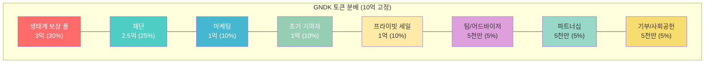
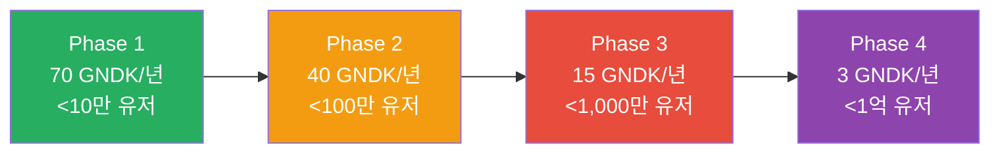
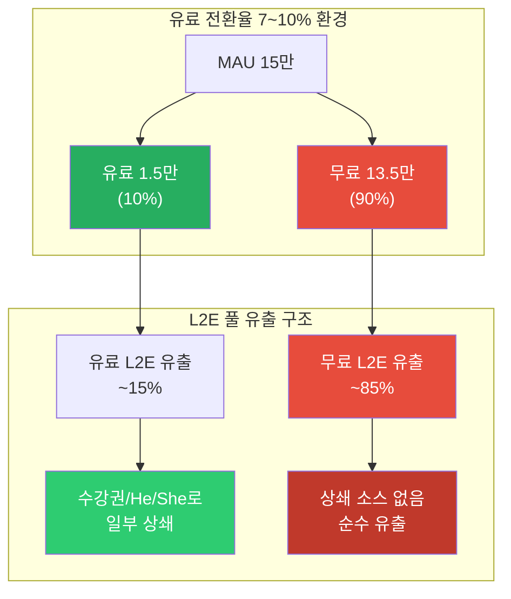
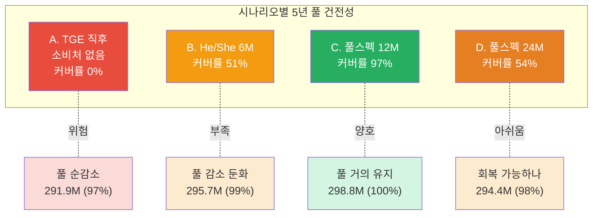
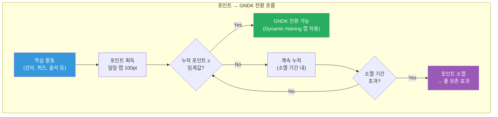
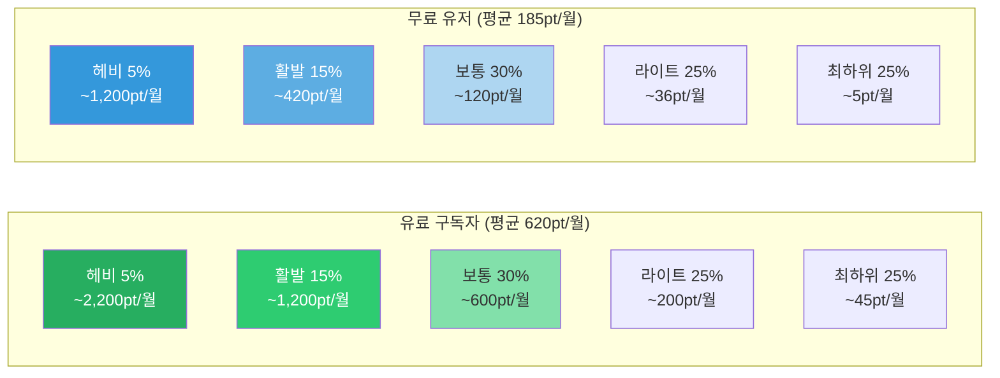
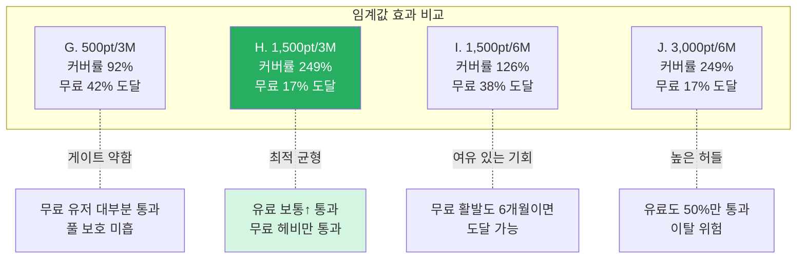
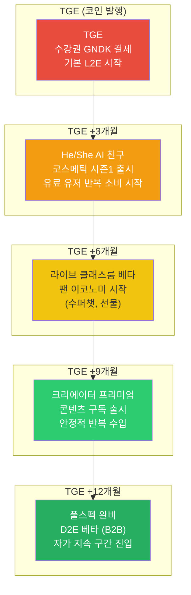
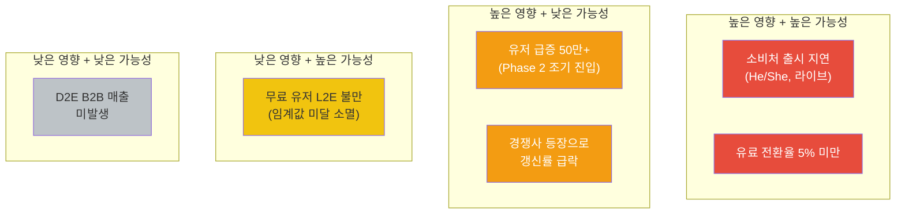
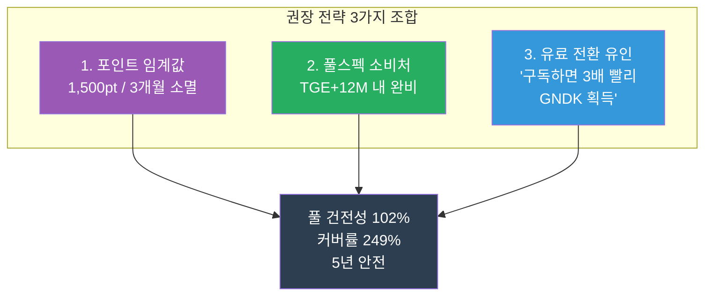

# GNDK 토크노믹스 시뮬레이션 보고서

> **문서 버전**: v1.0
> **작성일**: 2026-03-12
> **기준 사양**: EKYSS_L2E_TOKENOMICS_SOLANA.md v2.5.4-sol
> **시뮬레이션 기간**: 5년 (60개월)
> **시뮬레이션 코드**: `nskit-token/simulation/gndk-lifecycle.ts`

---

## 1. 요약 (Executive Summary)

GNDK 토큰의 **생태계 보상 풀(3억 GNDK, 30%)** 이 5년간 지속 가능한지를 검증하기 위해 10개 시나리오를 시뮬레이션했습니다.

### 핵심 결론

```
1. 풀스펙 소비처(He/She + 라이브 + 크리에이터)가 TGE+12개월 내 완비되면 풀은 안전
2. 포인트 전환 임계값(1,500pt / 3개월 소멸)이 가장 효율적인 풀 보호 장치
3. 유료 전환율 7~10%에서도 위 두 조건이 충족되면 풀 건전성 100%+ 유지
4. 서비스 출시가 늦어지면(24개월+) 풀은 안전하나 효율이 크게 떨어짐
```

### 시나리오별 5년 결과 요약

| 시나리오 | 풀 잔여 | HP% | 커버률 | 평가 |
|---------|---------|-----|--------|------|
| A. TGE 직후 (소비처 없음) | 291.9M | 97% | 0% | 위험 |
| C. 풀스펙 12M (전환10%) | 298.8M | 100% | 97% | 양호 |
| E. 유저 폭증 50만 (전환5%) | 280.8M | 94% | 38% | 경고 |
| F. 무료 L2E 하드리밋 30% | 305.0M | 102% | 238% | 우수 |
| **H. 임계값 1,500pt/3M + 풀스펙** | **305.2M** | **102%** | **249%** | **최적** |

> **HP%** = Pool Health Percentage (초기 3억 대비 잔여 비율)
> **커버률** = 소비처 리사이클 / L2E 유출 비율 (100% 이상 = 자가 지속)

---

## 2. 시뮬레이션 조건

### 2.1 토큰 기본 구조



| 항목 | 값 | 비고 |
|------|------|------|
| 총 발행량 | 10억 GNDK | TGE 후 Mint Authority 영구 포기 |
| 생태계 보상 풀 | 3억 (30%) | L2E + Creator 보상 원천 |
| BurnRecycle | 50% 영구 소각 / 50% 풀 리사이클 | 고정 비율 |
| Dynamic Halving | 70→40→15→3 GNDK/인/년 | 유저 수 기반 자동 전환 |
| $1 Peg | 앱 내 1 GNDK = 최소 $1 | 서비스 내 결제 가치 |

### 2.2 Dynamic Halving Phase



### 2.3 유저 성장 전제

| 항목 | 값 | 근거 |
|------|------|------|
| MAU 성장 | 5K → 10~15만 (5년) | 교육 앱 점진적 성장 |
| 유료 전환율 | 7~10% | 업계 현실 4~7%, 좋은 앱 10% |
| 수강권 가격 | $120/12개월 | GNDK $1 peg 기준 120 GNDK |
| 갱신률 | 35~45% | 교육 구독 서비스 평균 |

### 2.4 서비스 매출 (BurnRecycle 소스)

| 서비스 | 단가 (월/유저) | 대상 | 출시 시점 |
|--------|--------------|------|----------|
| 수강권 | $10/월 (연 $120) | 유료 유저 | TGE |
| He/She AI 코스메틱 | $3~15 | 유료 유저 | TGE +3~6M |
| 라이브 클래스룸 | $3~5 | MAU 30% | TGE +6~12M |
| 프리미엄 콘텐츠 | $2~3 | 유료 유저 | TGE +9~12M |
| D2E B2B 매출 | $10K~50K/월 | 전체 (B2B) | TGE +18M~ |

---

## 3. 핵심 발견

### 3.1 무료 유저가 풀 유출의 85~92%를 차지



**핵심 문제**: 유료 전환율이 현실적(7~10%)이면, MAU의 90%가 무료 유저입니다. 이 유저들이 L2E로 GNDK를 받지만, 앱 내 결제(BurnRecycle)에는 기여하지 않습니다. **풀 유출의 85~92%가 상쇄 불가**합니다.

### 3.2 소비처 출시 시점이 풀 생존을 결정



**소비처 없이(시나리오 A)** 수강권만으로는 커버률 0% — 풀이 계속 줄어듭니다.
**풀스펙이 12개월 내 갖춰지면(시나리오 C)** 커버률 97%로 풀이 자가 지속합니다.
**24개월까지 늦어지면(시나리오 D)** 커버률 54%로 풀은 안전하지만 효율이 반감됩니다.

### 3.3 포인트 전환 임계값 = 가장 우아한 방어 장치

사양서 Section 4.4에 정의된 **포인트 전환 임계값**이 풀 보호에 가장 효과적이면서 유저 차별이 없는 방식입니다.



---

## 4. 포인트 전환 임계값 상세 분석

### 4.1 실제 앱 포인트 규칙

| 활동 | 포인트 | 최대 | 비고 |
|------|--------|------|------|
| 룰렛 | 2~30pt | 1회 | 평균 ~14pt |
| 퀴즈 풀이 | 5pt/set | 3회 = 15pt | |
| 출석 | 5pt | 고정 | |
| 게시글 작성 | 5pt | 3회 = 15pt | |
| 게시글 댓글 | - | 최대 6pt | |
| 좋아요 | - | 최대 5pt | |
| 강의 시청 | 5pt | 5회 = 25pt | |
| 후원하기 | 30pt | 1회 | 유료 성격 |
| **이론 최대** | **~115pt** | **→100pt** | **일일 캡 적용** |

### 4.2 유저 타입별 월간 포인트 추정



### 4.3 임계값별 도달 분석 (권장: 1,500pt / 소멸 3개월)

**1,500pt 임계값 + 3개월 소멸 기준** 각 등급의 누적 포인트와 도달 여부:

| 유저 등급 | 유료 3개월 누적 | 도달 | 무료 3개월 누적 | 도달 |
|----------|----------------|------|----------------|------|
| 헤비 (5%) | 6,510pt | ✅ | 1,943pt | ✅ |
| 활발 (15%) | 3,534pt | ✅ | 1,055pt | ❌ |
| 보통 (30%) | 1,860pt | ✅ | 555pt | ❌ |
| 라이트 (25%) | 595pt | ❌ | 178pt | ❌ |
| 최하위 (25%) | 130pt | ❌ | 39pt | ❌ |

```
유료 임계값 도달률: 54.1% (헤비+활발+보통)
무료 임계값 도달률: 16.9% (헤비 일부만)
무료 L2E 자연 차단: 66%
```

### 4.4 임계값 시나리오 비교

| 시나리오 | 임계값 | 소멸 | 유료 도달 | 무료 도달 | 5Y 풀 | 커버률 |
|---------|--------|------|----------|----------|-------|--------|
| G. 500pt/3M | 500pt | 3개월 | 74% | 42% | 298.2M | 92% |
| **H. 1,500pt/3M** | **1,500pt** | **3개월** | **54%** | **17%** | **305.2M** | **249%** |
| I. 1,500pt/6M | 1,500pt | 6개월 | 67% | 38% | 301.2M | 126% |
| J. 3,000pt/6M | 3,000pt | 6개월 | 54% | 17% | 305.2M | 249% |



**권장안: H (1,500pt / 3개월 소멸)**
- 유료 보통 유저가 "3개월 꾸준히 하면 GNDK 받는다" → 최적의 학습 유인
- 무료 헤비 유저(상위 5%)만 도달 → "열심히 하면 무료도 가능" 메시지
- 나머지 포인트 소멸 → 풀 66% 자연 보존
- 모든 유저에게 동일 규칙 → 차별 논란 없음

---

## 5. 서비스 출시 타임라인 권장



### 출시 시점별 영향

| 서비스 | 권장 시점 | 지연 시 영향 | 비고 |
|--------|----------|-------------|------|
| **He/She AI 코스메틱** | TGE +3M | 커버률 40%p 하락 | 가장 임팩트 큰 소비처 |
| **라이브 클래스룸** | TGE +6M | 커버률 20%p 하락 | 고액 소비 (팬 경제) |
| **크리에이터 프리미엄** | TGE +9M | 커버률 10%p 하락 | 안정적 반복 수입 |
| **D2E B2B** | TGE +18M | 장기 디플레이션 손실 | 외부 매출 → Buyback&Burn |

### 주의: 12개월 vs 24개월 차이

| 비교 항목 | 풀스펙 12M (시나리오 C) | 풀스펙 24M (시나리오 D) |
|----------|----------------------|----------------------|
| 5년 풀 잔여 | 298.8M (100%) | 294.4M (98%) |
| 커버률 | 97% | 54% |
| 누적 소각 | 10.2M | 5.1M |
| 평가 | 자가 지속 | 회복은 되나 효율 반감 |

> **풀스펙 출시가 12개월 늦어지면 커버률이 97% → 54%로 거의 반감됩니다.
> He/She AI 코스메틱이 가장 중요한 소비처이므로 TGE +3개월 내 출시가 필수입니다.**

---

## 6. 리스크 분석

### 6.1 리스크 매트릭스



### 6.2 리스크별 상세

| # | 리스크 | 영향 | 대응 방안 |
|---|--------|------|----------|
| R1 | **소비처 출시 지연** | 커버률 급락 → 풀 순감소 | He/She 최우선 개발, MVP 빠른 출시 |
| R2 | **전환율 5% 미만** | 무료 L2E 유출 92%+ → 풀 압박 | 포인트 임계값으로 자연 조절 + 무료→유료 전환 캠페인 |
| R3 | **유저 급증 50만+** | Phase 2 진입(40 GNDK/년)으로 자동 완화되나, 전환기 풀 유출 증가 | Dynamic Halving이 자동 보호. 급증 시 서비스 매출도 비례 증가 기대 |
| R4 | **갱신률 급락** | 유료 유저 이탈 → BurnRecycle 감소 | 콘텐츠 품질 유지 + 락인 전략 (He/She 커스텀 등) |
| R5 | **무료 유저 포인트 소멸 불만** | CS 이슈, 리뷰 악화 | UX에서 "N pt 더 모으면 GNDK 전환 가능" 유도 메시지 + 소멸 전 알림 |
| R6 | **D2E B2B 매출 미발생** | 장기 Buyback&Burn 효과 없음 | D2E는 보너스로 취급. 핵심 방어는 서비스 소비처 + 임계값 |

### 6.3 최악의 시나리오 (시나리오 E: 유저 폭증 + 전환율 5%)

| 항목 | 수치 |
|------|------|
| MAU | 50만 |
| 유료 전환율 | 5% |
| 5년 풀 잔여 | 280.8M (94%) |
| 커버률 | 38% |
| 무료 L2E 비중 | 92% |
| 평가 | 풀 고갈은 없으나, 연간 4M GNDK 순유출 |

> **풀 고갈(0%)에 도달하지는 않습니다** — Dynamic Halving이 유저 수 증가에 따라 인당 보상을 자동 삭감하기 때문입니다. 그러나 **포인트 임계값 없이는 커버률이 38%로 낮아** 장기적으로 풀이 빈약해집니다.

---

## 7. 권장 전략

### 7.1 최적 조합



### 7.2 포인트 임계값 설정 권장

| 항목 | 권장값 | 근거 |
|------|--------|------|
| 전환 임계값 | **1,500pt** | 유료 보통 유저 3개월 도달, 무료 헤비만 도달 |
| 소멸 기간 | **3개월** | 적절한 긴장감 + 학습 동기 부여 |
| 일일 캡 | 100pt (현행 유지) | 어뷰징 방지 + 균등한 기회 |

**왜 1,500pt인가?**
- 유료 보통 유저: 620pt/월 × 3개월 = 1,860pt → 3개월이면 도달
- 무료 보통 유저: 185pt/월 × 3개월 = 555pt → 미도달 (소멸)
- 무료 헤비 유저: 1,200pt/월 → 2개월이면 도달 → "열심히 하면 무료도 가능"
- **유료 전환 메시지**: "구독하면 월 620pt, 3개월이면 GNDK 받아요"

### 7.3 서비스 출시 우선순위

| 순위 | 서비스 | 마감 | 이유 |
|------|--------|------|------|
| 1 | **He/She AI 코스메틱** | TGE +3M | 커버률 40%p 좌우, 반복 소비 핵심 |
| 2 | **라이브 클래스룸** | TGE +6M | 고액 소비 (팬 경제), 커버률 20%p |
| 3 | **크리에이터 프리미엄** | TGE +9M | 안정적 월정액, 생태계 확장 |
| 4 | **D2E B2B** | TGE +18M | 외부 매출 → Buyback&Burn (보너스) |

---

## 8. 시뮬레이션 전체 결과표

### 8.1 10개 시나리오 비교

| # | 시나리오 | MAU | 전환율 | 풀스펙 | 임계값 | 5Y 풀 | HP% | 커버률 | 무료 L2E% |
|---|---------|-----|--------|--------|--------|-------|-----|--------|----------|
| A | TGE 직후 (소비처 없음) | 10만 | 7% | 없음 | 없음 | 291.9M | 97% | 0% | 89% |
| B | He/She 6M 출시 | 10만 | 7→10% | 부분 | 없음 | 295.7M | 99% | 51% | 85% |
| C | 풀스펙 12M 완비 | 15만 | 7→10% | 12M | 없음 | 298.8M | 100% | 97% | 85% |
| D | 풀스펙 24M 완비 | 15만 | 7→9% | 24M | 없음 | 294.4M | 98% | 54% | 86% |
| E | 유저 폭증 50만 | 50만 | 5% | 부분 | 없음 | 280.8M | 94% | 38% | 92% |
| F | 무료 L2E 하드리밋 30% | 15만 | 7→10% | 12M | 하드리밋 | 305.0M | 102% | 238% | 63% |
| G | 임계값 500pt/3M | 15만 | 7→10% | 12M | 500pt | 298.2M | 99% | 92% | 86% |
| **H** | **임계값 1,500pt/3M** | **15만** | **7→10%** | **12M** | **1,500pt** | **305.2M** | **102%** | **249%** | **74%** |
| I | 임계값 1,500pt/6M | 15만 | 7→10% | 12M | 1,500pt | 301.2M | 100% | 126% | 84% |
| J | 임계값 3,000pt/6M | 15만 | 7→10% | 12M | 3,000pt | 305.2M | 102% | 249% | 74% |

### 8.2 핵심 지표 해석

- **HP% ≥ 100%**: 풀이 초기 3억 이상 유지 (리사이클이 유출을 상회)
- **커버률 ≥ 100%**: 서비스 소비처가 L2E 유출을 완전히 커버
- **무료 L2E% < 80%**: 무료 유저 유출이 관리 가능한 수준

---

## 9. 부록: 주요 수식

### BurnRecycle 계산

```
서비스 결제 GNDK = 수강권 + He/She + 라이브 + 프리미엄
  → 50% 영구 소각 (실효 공급 감소)
  → 50% 보상 풀 리사이클 (풀 복원)
```

### D2E Buyback & Burn

```
D2E B2B 월 매출 (USD)
  → 40% 시장 매입 후 소각 (시장 공급 감소)
  → 30% D2E Bounty Pool 리사이클
  → 30% 운영비
```

### 포인트 → GNDK 전환

```
조건: 누적 포인트 ≥ 전환 임계값
변환: 포인트 수량 → GNDK 시세 기반 환산
한도: Dynamic Halving 인당 연간 캡 적용 (70/40/15/3 GNDK)
미달 시: 소멸 기간 내 미도달 포인트 소멸 → 풀 보존
```

---

## 10. 결론

```
GNDK 토크노믹스는 다음 3가지 조건이 충족되면 5년간 풀 건전성 100% 이상 유지:

1. 포인트 전환 임계값 1,500pt / 3개월 소멸 적용
2. He/She AI 코스메틱을 TGE +3개월 내 출시
3. 풀스펙 소비처(라이브, 크리에이터, D2E)를 TGE +12개월 내 완비

이 조건이 충족되면:
  - 풀 잔여: 305.2M (초기 대비 102%)
  - 커버률: 249% (자가 지속)
  - 누적 소각: 10.2M (디플레이션 효과)
  - 무료 유저 L2E 66% 자연 차단 (포인트 소멸)

포인트 임계값은 사양서에 이미 설계된 메커니즘이며,
모든 유저에게 동일 규칙을 적용하므로 차별 논란이 없습니다.
```

---

*본 보고서는 `gndk-lifecycle.ts` 시뮬레이션 결과를 기반으로 작성되었습니다.*
*시뮬레이션 실행: `npx ts-node --project simulation/tsconfig.json simulation/gndk-lifecycle.ts`*
