# GANADA TOKEN (GNDK) Tokenomics — Solana Edition

> Learn-to-Earn 기반 언어 학습 플랫폼 토크노믹스 설계서 (Solana 체인 버전)
>
> **버전**: Draft 2.5.4-sol
> **작성일**: 2025-01-24
> **최종 수정**: 2026-03-11
> **상태**: 스마트 컨트랙트 제작용 기술 설계서
> **참조**: [gndtoken.com](https://gndtoken.com)
> **원본**: GNDK(WhitePaper)_ENG_v2.5_260304.pdf

---

## 0. Solana 버전 변경 요약

> 이 문서는 원본 토크노믹스 문서를 **Solana 체인 기준**으로 fork한 버전입니다.
> 체인이 변경될 경우 원본 문서 기반으로 다시 확장할 수 있습니다.

| 항목 | 원본 (체인 미확정) | Solana 버전 |
|------|-------------------|------------|
| 네트워크 | 파트너 체인 협의 중 | **Solana Mainnet-Beta** |
| 토큰 표준 | ERC-20 | **SPL Token + OFT Adapter** |
| 소수점 | 18 | **9** (Solana 표준) |
| 스마트 컨트랙트 | Solidity | **Rust (Anchor Framework)** |
| 개발 도구 | Hardhat/Foundry | **Anchor / solana-test-validator** |
| 테스트넷 | 미정 | **Solana Devnet** |
| DEX | 미정 | **Raydium / Jupiter / Orca** |
| NFT 표준 | ERC-721/ERC-1155 | **Metaplex Token Standard** |
| 프론트엔드 | ethers.js / viem | **@solana/web3.js / @solana/spl-token** |
| 멀티체인 확장 | 미정 | **LayerZero OFT Adapter (홈체인 Lock/Unlock, 리모트 Burn/Mint)** |
| 용어 | Contract / address / Gas | **Program / Pubkey / Transaction Fee** |

---

## 1. 개요

### 1.1 프로젝트 소개

GANADA TOKEN(GNDK)은 이카이스(EKYSS) 주식회사가 운영하는 언어 학습 플랫폼의 **Learn-to-Earn(L2E) + Data-to-Earn(D2E)** 유틸리티 토큰입니다. 단순 학습 보상을 넘어 **'Decentralized Global AI Data Hub'** — 학습 과정에서 생성되는 고품질 다국어 데이터(음성, 번역, 대화)를 글로벌 AI 기업에 공급하고, 그 수익을 생태계에 환원하는 **Dual-Engine 디플레이션 모델**을 구현합니다.

| 플랫폼 | 대상 | 서비스 | 상태 |
|--------|------|--------|------|
| 마이풀 (Platform K) | 한국인 | 외국어 학습 | 운영 중 (2025.09~) |
| GANADARA (Platform G) | 외국인 | 한국어 학습 | 운영 중 (2026.01~) |

### 1.2 핵심 가치

1. **리버스 토큰**: 완성된 서비스를 기반으로 토큰 발행 (서비스 먼저, 토큰 나중)
2. **학습 증명 채굴(PoL)**: AI 시스템이 학습 활동을 검증하고 포인트 → GNDK 전환
3. **$1 최소 가치 보장**: MYPOOL/GANADARA 앱 내에서 1 GNDK = 최소 $1 결제 가치 보장
4. **고정 발행량**: 10억 GNDK 고정, TGE 후 Mint Authority 영구 포기 (추가 발행 0%)
5. **D2E (Data-to-Earn)**: 학습 데이터를 글로벌 AI 기업에 공급 → 매출의 40% Buyback & Burn + 30% D2E Bounty Pool 리사이클 → **Dual-Engine 디플레이션**

### 1.3 왜 Solana인가?

| 기준 | Solana | EVM (Ethereum/Base) |
|------|--------|---------------------|
| 트랜잭션 비용 | ~$0.001 | $0.01~$5+ |
| TPS | ~4,000+ | 체인별 상이 (15~4,000) |
| 확정 시간 | ~400ms | 1초~12초 |
| L2E 적합성 | 소액 보상 빈번 지급에 최적 | 가스비 부담으로 배치 필수 |
| 소비자 앱 생태계 | 활발 (DePIN, GameFi 등) | DeFi 중심 |
| 지갑 보급 | Phantom, Solflare 등 | MetaMask 등 |

> **L2E 서비스 특성상 소액 보상을 자주 지급해야 하므로, 트랜잭션 비용이 극히 낮은 Solana가 최적입니다.**

---

## 2. 토큰 기본 정보

| 항목 | 내용 |
|------|------|
| 토큰명 | GANADA TOKEN |
| 심볼 | GNDK |
| 네트워크 | **Solana Mainnet-Beta** |
| 토큰 표준 | **SPL Token + LayerZero OFT Adapter** |
| 총 발행량 | 1,000,000,000 GNDK **(고정, 추가 발행 영구 불가)** |
| 토큰 타입 | Utility Token (법적 분류) |
| 획득 방식 | L2E (Learn-to-Earn) + D2E (Data-to-Earn) |
| 소수점 | **9** (Solana 표준) |
| Mint Authority | **TGE 후 영구 포기 (Renounce) — 재단 임의 발행 리스크 0%** |
| Freeze Authority | **비활성화 (Renounce)** |
| 앱 내 최소 가치 | **1 GNDK = $1 (MYPOOL/GANADARA 앱 내 결제 가치 보장)** |
| 멀티체인 확장 | **LayerZero OFT Adapter 탑재** |

> **소수점 참고**: Solana SPL Token 표준은 9자리를 사용합니다 (EVM의 18자리와 다름). 1 GNDK = 1,000,000,000 lamports (10^9).
>
> **$1 Peg 메커니즘**: MYPOOL/GANADARA 앱 내에서 1 GNDK의 결제 가치는 항상 최소 $1로 보장됩니다. 시장 가격이 $1 미만이면 사용자는 거래소에서 GNDK를 싸게 구입하여 앱 내 결제에 사용할 수 있어 자연스러운 매수 압력이 형성됩니다 (아비트라지 효과). 시장 가격이 $1을 초과하면 초과분도 인정되어 더 높은 가격으로 결제에 사용 가능합니다.

---

## 3. 토큰 분배

### 3.1 분배 구조

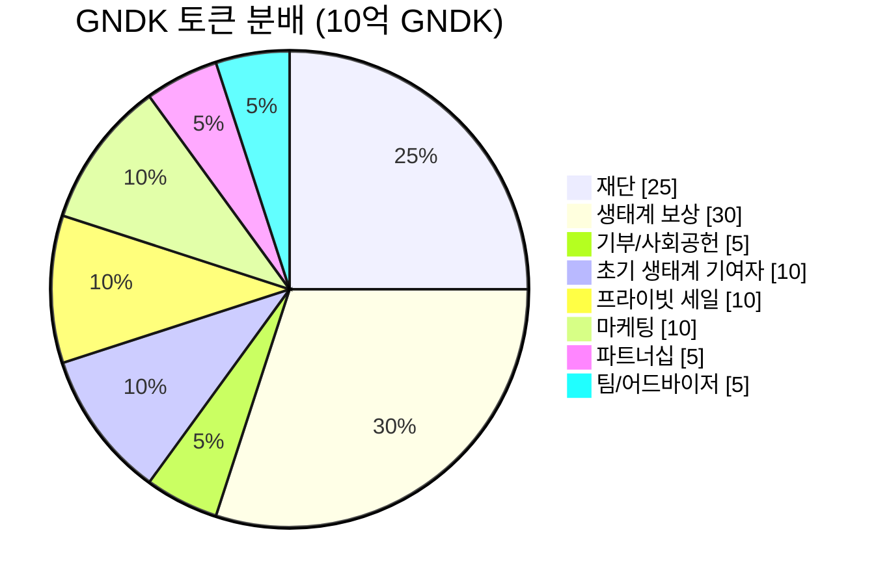

### 3.2 분배 상세

| 구분 | 비율 | 수량 (GNDK) | 용도 |
|------|------|-----------|------|
| 재단 | 25% | 250,000,000 | 생태계 운영 지원 및 미래 개발 (즉시 해제) |
| 생태계 보상 | 30% | 300,000,000 | L2E 보상, 크리에이터 보상 (인당 연간 최대 70 GNDK, 동적 하빙) |
| 기부/사회공헌 | 5% | 50,000,000 | 자선 기부 및 사회 공헌 |
| 초기 생태계 기여자 | 10% | 100,000,000 | eKYSS 및 Crates 초기 핵심 투자자 (1년 락업, 1년 선형 베스팅) |
| 프라이빗 세일 | 10% | 100,000,000 | GNDK 초기 투자자 (1년 락업, 1년 선형 베스팅) |
| 팀/어드바이저 | 5% | 50,000,000 | 핵심 인력 유지 (1년 락업, 2년 선형 베스팅) |
| 마케팅 | 10% | 100,000,000 | 마케팅 활동 |
| 파트너십 | 5% | 50,000,000 | 한류/K-Culture 콘텐츠, IP 및 파트너사 협업 |

### 3.3 베스팅 스케줄

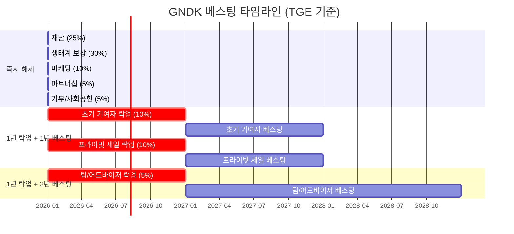

| 구분 | 락업 | 베스팅 기간 | 비고 |
|------|------|------------|------|
| 재단 | 없음 | 즉시 해제 | 생태계 운영 지원 |
| 생태계 보상 | 없음 | 활동 시 즉시 | 스마트 컨트랙트 관리, 인당 연간 최대 70 GNDK + 동적 하빙 |
| 기부/사회공헌 | 없음 | 필요 시 | 자선 기부 및 사회 공헌 |
| 초기 생태계 기여자 | 1년 | 1년 선형 | eKYSS 및 Crates 초기 핵심 투자자 |
| 프라이빗 세일 | 1년 | 1년 선형 | GNDK 초기 투자자 |
| 팀/어드바이저 | 1년 | 2년 선형 | 핵심 인력 유지 |
| 마케팅 | 없음 | 필요 시 | 캠페인별 집행 |
| 파트너십 | 없음 | 필요 시 | 마일스톤 기반 |

> **주요 변경**: 재단은 즉시 해제. 팀/어드바이저는 1년 락업. 초기 생태계 기여자/프라이빗 세일도 1년 락업 + 1년 선형 베스팅.
>
> **Solana 베스팅 구현**: 커스텀 Anchor 프로그램 사용 (부록 C T-9). 3개 instruction (initialize_vesting, claim, get_vesting_info)으로 구현. 각 배분 항목별 별도 Token Account + PDA 기반 시간 잠금.

---

## 4. Earn 메커니즘 (L2E + D2E)

### 4.1 핵심 원칙: 학습 증명 채굴 (Proof of Learning)

> **학습 활동 → AI 검증 → 포인트 → GNDK 전환** - AI가 학습 활동을 검증/평가하고, 성과 기반 포인트를 분배한 후 GNDK로 전환
>
> **참고**: 홈페이지(gndtoken.com)에서는 포인트 기반 전환 방식으로 안내. 기술 구현 시 Merkle 기반 배치 처리 구조는 유지하되, 사용자 경험(UX)은 포인트 → 토큰 전환 흐름으로 제공.

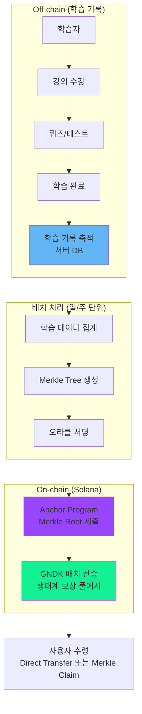

### 4.2 포인트 → 토큰 전환 구조 (홈페이지 기준)

| 단계 | 설명 |
|------|------|
| 1. 학습 활동 | 강의 수강, 퀴즈, 스피킹 연습 등 |
| 2. AI 검증/평가 | AI 시스템이 학습 활동 분석 및 성과 평가 |
| 3. 포인트 분배 | 성과 기반 포인트 지급 |
| 4. GNDK 전환 | 포인트를 GNDK로 전환 (Merkle 기반 배치 처리) |

> **기술 구현 참고**: 포인트 → GNDK 전환 시 초기에는 Direct Transfer, 이후 Merkle Tree 기반 배치 처리로 전환. 보상은 생태계 보상 풀(3억 GNDK)에서 전송 (Mint Authority 영구 포기로 신규 발행 불가).

### 4.3 Solana에서의 배치 처리 이점

| 항목 | EVM 체인 | Solana |
|------|---------|--------|
| Merkle Root 제출 비용 | $1~$50 (가스비) | **~$0.001** |
| 사용자 Claim 비용 | $0.50~$10 | **~$0.001** |
| 배치 주기 | 주간 (비용 절감) | **일간 가능** (비용 무시) |
| 사용자 부담 | Claim 가스비 부담 | **거의 무료** |

> **Solana의 낮은 트랜잭션 비용으로 배치 주기를 일간으로 단축 가능. 사용자가 Claim 시 가스비 부담이 거의 없어 UX 대폭 개선.**

### 4.4 포인트 → GNDK 전환 시스템

> **핵심**: 앱 내에서 학습 보상은 **포인트(off-chain)**로 지급되며, 사용자가 전환 신청 시 **GNDK 시세 기반**으로 토큰으로 교환됩니다. 이를 통해 GNDK 시장 가격 변동과 무관하게 앱 내 보상 체계를 안정적으로 운영할 수 있습니다.

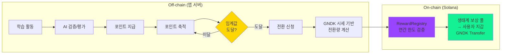

| 항목 | 설명 |
|------|------|
| **포인트 지급** | 앱 서버에서 학습 활동별 포인트 지급 (강의 완료, 퀴즈, 연속 학습 등) |
| **전환 비율** | GNDK 시장 가격에 연동 — 시세가 오르면 같은 포인트로 적은 GNDK 수령 |
| **전환 임계값** | 최소 전환 가능 포인트 설정 (미달 시 누적, 소멸 정책은 off-chain) |
| **연간 한도** | Dynamic Halving에 따른 인당 연간 최대 GNDK (Phase별 70→40→15→3) |
| **SC 역할** | `distribute_reward(user, amount)` — 최종 GNDK 수량만 전달받아 전송 |

> **SC 관점**: 스마트 컨트랙트는 포인트 개념을 모릅니다. 앱 서버가 포인트→GNDK 전환량을 계산하고, 최종 GNDK 수량만 온체인에 전달합니다. 컨트랙트는 연간 한도 초과 여부만 검증합니다.

### 4.5 어뷰징 방지

| 방지 메커니즘 | 설명 |
|--------------|------|
| AI 학습 분석 | 실제 학습 패턴 vs 봇 패턴 구분 |
| 시간 검증 | 비정상적 빠른 완료 탐지 |
| 디바이스 핑거프린팅 | 다중 계정 방지 |
| ~~일일 한도~~ | ~~일일 최대 획득 GNDK 제한~~ → **온체인 일일 한도 없음** (T-6). 연간 한도만 적용. 일일 속도 제어는 off-chain(앱 서버)에서 포인트 지급량으로 조절. |

### 4.6 Dynamic Halving 모델 (동적 하빙)

토큰 가치 하락을 방지하기 위해, 보상은 **결제 확인된 유료 구독자(KYC 인증)만** 대상으로 하며, 글로벌 사용자 기반이 성장할수록 인당 연간 획득 한도가 자동으로 감소합니다. 이는 Early Adopter에게 가장 큰 혜택을 제공하여 생태계 초기 성장을 유도합니다.

| Phase | 글로벌 사용자 규모 | 인당 연간 최대 GNDK |
|-------|-----------------|---------------------|
| Phase 1 (초기 정착) | ~100,000명 | **70 GNDK** |
| Phase 2 (성장기) | ~1,000,000명 | **40 GNDK** |
| Phase 3 (확장기) | ~10,000,000명 | **15 GNDK** |
| Phase 4 (글로벌 정착) | ~100,000,000명 | **3 GNDK** |

> **연간 한도 리셋**: UTC 기준 TGE 기념일(365일 주기)에 전체 유저 동시 리셋. UserAccount PDA의 `last_reset_year` 필드와 현재 연도를 비교하여 `claim` instruction 호출 시 자동 리셋. 가입일 기준 개별 리셋은 복잡도 대비 이점이 없어 채택하지 않음.

> **보상 지급 방식**: 초기에는 사용자 가스비 부담을 없애고 UX를 최대화하기 위해 eKYSS 중앙 서버에서 사용자 지갑으로 **Direct Transfer** 방식을 채택합니다. 시스템 안정화 후 (50,000 DAU 달성 시) Multi-sig 및 DAO 거버넌스 구조로 전환합니다.
>
> **장기 생존 시뮬레이션**: 엄격한 '연간 획득 하드캡(하빙)'과 '50% 리사이클 로직'을 결합하면, 초기 배분된 3억 GNDK 보상 풀은 1억 명의 활성 사용자에서도 수학적으로 고갈되지 않는 완벽한 안정성을 달성합니다.

#### Phase 자동 전환 (온체인)

> **조작 방지**: Phase 전환은 관리자 수동 실행이 아닌, **온체인 자동 전환**입니다. KYC 인증 유료 구독자 수가 threshold를 넘으면 스마트 컨트랙트가 자동으로 다음 Phase로 전환합니다.

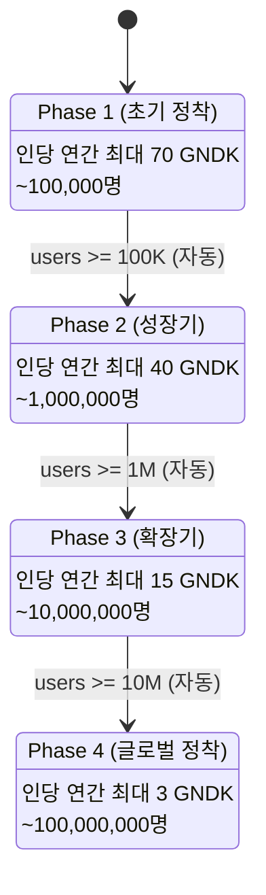

**온체인 자동 전환 로직:**

```
ConfigAccount PDA:
├── total_registered_users: u64    ← KYC 인증 누적 등록 사용자 수
├── current_phase: u8              ← 현재 Phase (1~4)
├── phase_thresholds: [u64; 4]     ← [100K, 1M, 10M, 100M]
├── phase_caps: [u64; 4]           ← [70, 40, 15, 3] GNDK

register_user(user_pubkey):
├── 오라클이 KYC 검증된 사용자만 호출
├── 사용자 PDA 생성 (1회만, 중복 등록 방지)
├── total_registered_users += 1
├── if users >= threshold → current_phase += 1
└── emit!(PhaseChanged { new_phase, user_count, timestamp })

★ Phase는 단방향(1→2→3→4)만 가능, 역행 불가
```

> **투명성**: 모든 Phase 전환 이벤트와 사용자 수가 온체인에 기록되어 누구나 검증 가능합니다.

### 4.7 D2E (Data-to-Earn) — AI 데이터 마켓플레이스

> **v2.5 핵심 신규 개념**: 학습 앱은 AI 시장이 필요로 하는 '고품질 데이터 팩토리'입니다. 학습자가 외국어를 학습하는 과정에서 자연스럽게 생성하는 음성/번역/대화 데이터를 익명화·동의 기반(Opt-in)으로 수집하여 글로벌 AI 기업에 판매하고, 그 수익을 생태계에 환원합니다.

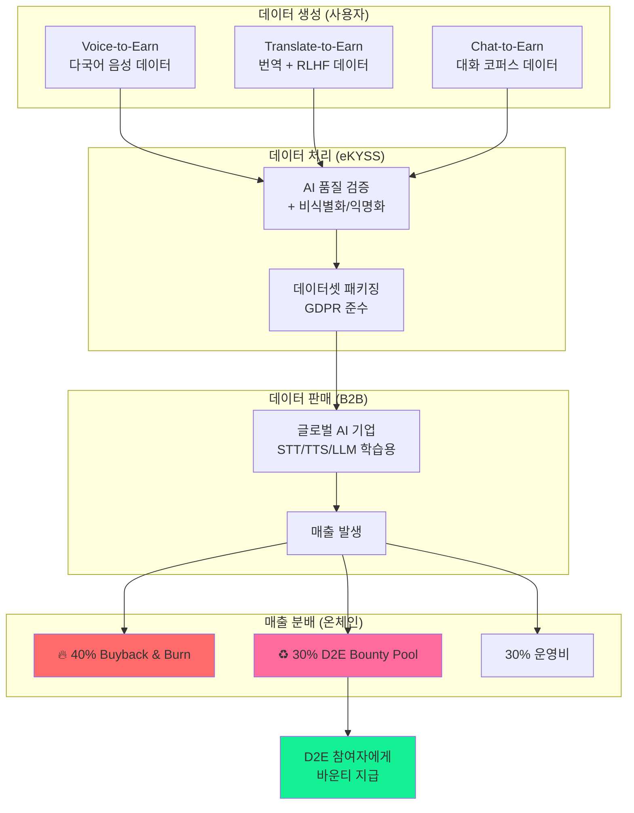

#### (1) Voice-to-Earn (다국어 음성 멀티모달 데이터 수집)

- 사용자가 앱 내에서 K-Pop 가사, K-Drama 명대사 등을 낭독
- 시스템이 발음, 노이즈, 악센트를 1차 평가
- 전 세계 수백 개국 사용자의 실제 발음·악센트 데이터 → 글로벌 AI STT/TTS 모델 학습용 멀티모달 데이터셋
- 참여자에게 프리미엄 GNDK 바운티 지급

#### (2) Translate-to-Earn (집단지성 번역 & RLHF 데이터 구축)

- 사용자가 AI 번역 결과를 모국어로 교정하거나, 미번역 숏폼/신조어를 번역
- 다수 사용자 크로스 검증(Consensus) → 최고급 RLHF(Reinforcement Learning from Human Feedback) 데이터셋
- 참여자에게 GNDK 바운티 지급

#### (3) Chat-to-Earn (자연어 대화 코퍼스 수집)

- 사용자가 감정인식 AI 아바타 'He & She'와 주어진 롤플레잉 상황에서 대화
- 자연스러운 문맥 흐름의 'Conversational Corpus' → LLM 파인튜닝용 최고급 데이터
- 참여자에게 GNDK 바운티 지급

> **GDPR 준수**: 모든 데이터는 사용자 명시적 동의(Opt-in) 하에 엄격히 비식별화·익명화 처리.

#### D2E 스마트 컨트랙트 관점

| 항목 | 구현 내용 |
|------|---------|
| **D2E Bounty Pool** | 생태계 보상 풀과 별도의 PDA Token Account. B2B 데이터 매출의 30%가 시장 매입 후 여기로 리사이클 |
| **D2E Bounty 분배** | AI 기업이 특정 데이터 미션 의뢰 (예: "한국어 발음 베트남 화자 1만 시간") → 사용자 참여 → 검증 → 바운티 지급 |
| **L2E 한도 초과 가능** | D2E 바운티는 L2E Dynamic Halving의 연간 한도 (70→40→15→3 GNDK)에 포함되지 않음 — 별도 보상 |
| **B2B 매출 자동 분배** | 매출의 40% → 시장 매입 후 영구 소각 (Buyback & Burn), 30% → D2E Bounty Pool 리사이클 |

> **D2E 실행 전략**: D2E는 앱 서비스 수정(음성 수집 UI, 동의 플로우, 데이터 파이프라인, B2B 계약)이 SC보다 훨씬 큰 비중을 차지하므로, TGE 시점에는 **계획 공개 + 홍보 자료**로 갈음하고, 실제 D2E Module 배포 및 운영은 앱/B2B 준비 완료 후 진행. SC 측은 D2EBountyPool PDA를 빈 상태로 선행 구축만 함.

### 4.8 Dual Reward 요약

| 보상 유형 | 소스 | 한도 | 대상 |
|---------|------|------|------|
| **Basic L2E** | 생태계 보상 풀 (3억 GNDK) | 인당 연간 최대 70→3 GNDK (Dynamic Halving) | KYC 인증 유료 구독자 |
| **Premium D2E** | D2E Bounty Pool (B2B 매출 리사이클) | 미션별 바운티 (L2E 한도 외 추가 보상) | Opt-in 데이터 제공 사용자 |

---

## 5. 크리에이터 경제

### 5.1 크리에이터 보상 사이클

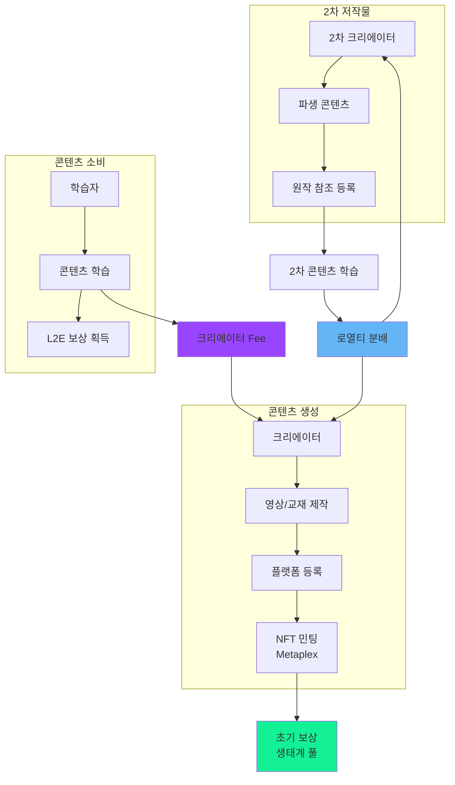

### 5.2 크리에이터 보상 구조

| 보상 유형 | 금액/비율 | 조건 |
|----------|----------|------|
| 콘텐츠 등록 보상 | 100 GNDK | 플랫폼 승인 시 |
| 학습 Fee | 학습 보상의 10% | 학습 완료 시 자동 |
| 조회수 보상 | 1,000회당 50 GNDK | 월간 정산 |
| 구독자 보상 | 구독료의 70% | 구독 갱신 시 |

### 5.3 2차 저작물 로열티

2차 저작물까지 로열티를 지원합니다 (운영 복잡도로 3차 이상 미지원).

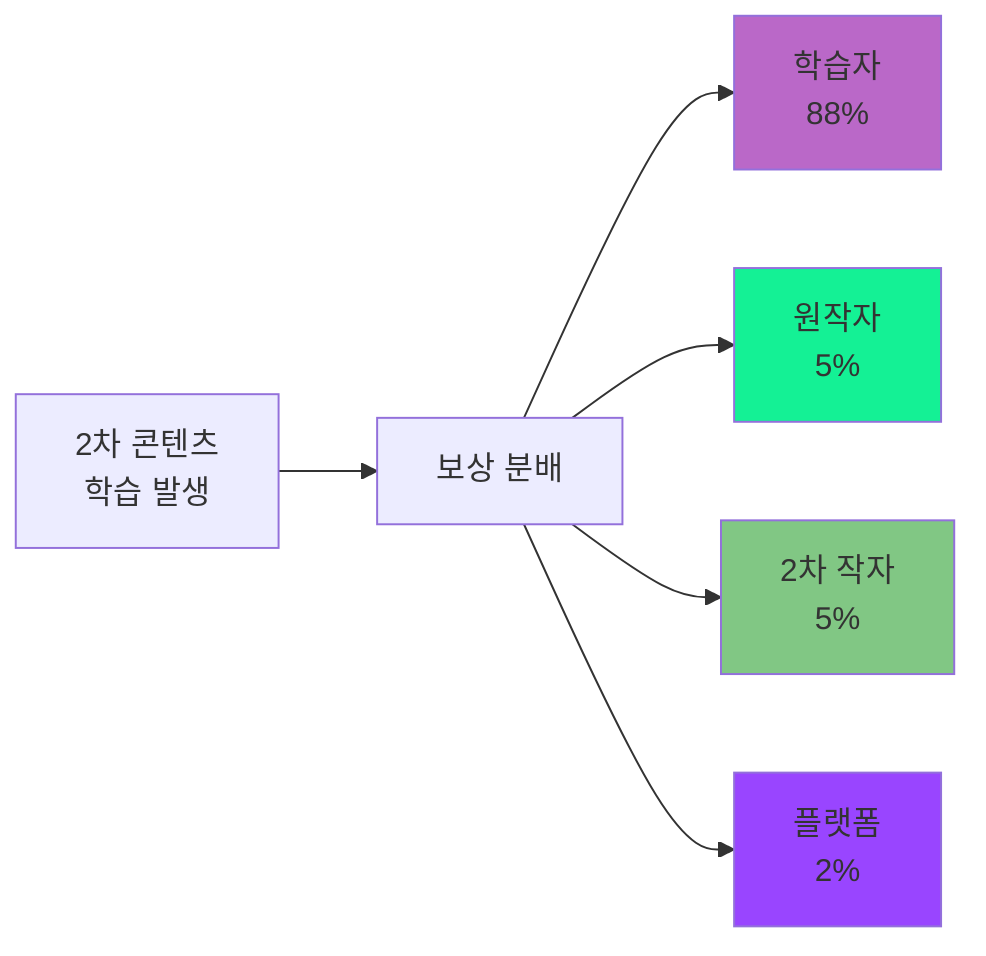

---

## 6. 토큰 사용처

### 6.1 서비스 내 사용

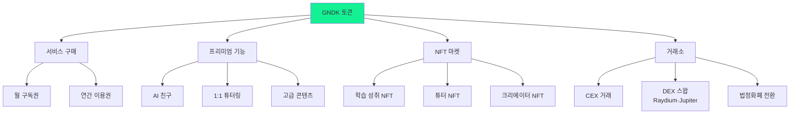

### 6.2 서비스 결제 시 Burn & Recycle

모든 서비스 결제에 사용된 GNDK는 스마트 컨트랙트로 수집되어 **50% 영구 소각 + 50% 생태계 보상 풀 리사이클**로 자동 분배됩니다.

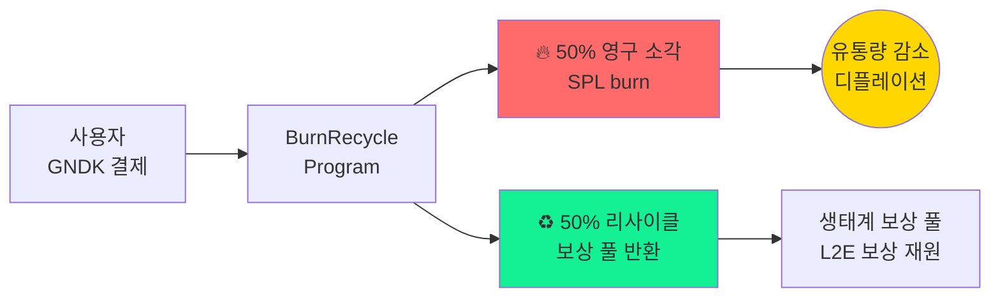

| 사용처 | GNDK 결제 | 영구 소각 (50%) | 보상 풀 리사이클 (50%) |
|--------|----------|---------------|---------------------|
| 월간 구독 | 100% | 50% | 50% |
| 연간 구독 | 100% | 50% | 50% |
| AI 친구 | 100% | 50% | 50% |
| 1:1 튜터링 | 100% | 50% | 50% |
| NFT 거래 | 100% | 50% | 50% |
| 굿즈/커머스 | 100% | 50% | 50% |

> **Solana 구현**: SPL Token의 `burn` instruction으로 50%를 영구 소각하고, 나머지 50%는 Ecosystem Reward PDA Account로 transfer. 모든 소각 이벤트는 Solscan에서 투명하게 추적 가능.
>
> **결제 활동이 증가할수록 디플레이션 가속**: 유료 구독자가 늘어날수록 소각량이 증가하여 유통량이 지속 감소하고, 동시에 리사이클로 보상 풀이 보충되어 생태계 지속 가능성 확보.

---

## 7. 토큰 공급 모델 — 고정 공급 + Burn & Recycle

### 7.1 고정 발행량 (추가 발행 영구 불가)

> **백서 v2.3 핵심 변경**: 기존 감소형 인플레이션 모델을 폐기하고, **10억 GNDK 고정 발행 + TGE 후 Mint Authority 영구 포기** 모델로 전환.

| 항목 | 내용 |
|------|------|
| 총 발행량 | 1,000,000,000 GNDK (10억, 고정) |
| 추가 발행 | **영구 불가** (Mint Authority TGE 후 소각) |
| 공급 감소 | Burn & Recycle 메커니즘으로 유통량 지속 감소 |
| 가치 방어 | $1 Peg + 아비트라지 효과 + 소각 디플레이션 |

### 7.2 Burn & Recycle — 무한 생태계 수명

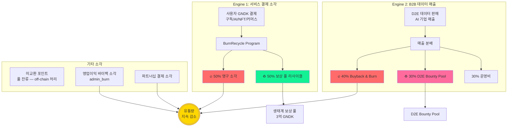

#### 1) 미교환 포인트의 구조적 보존 (off-chain)

- 사용자는 학습 활동으로 포인트를 획득하며, 일정 임계값 이상이어야 GNDK로 전환 가능
- 임계값 미달 포인트가 소멸되면 **GNDK 전환 요청이 발생하지 않는 것**이므로, 해당 토큰은 보상 풀에 그대로 잔류 → **보상 풀 보존 효과** (부록 C T-12)
- 별도 온체인 소각 로직 불필요 — SC는 포인트 개념을 모름 (Section 4.4)

#### 2) 서비스 수익 소각 (Sink 메커니즘)

사용자가 서비스 결제에 사용한 GNDK는 스마트 컨트랙트로 수집되어 자동 분배:

| 구분 | 비율 | 설명 |
|------|------|------|
| **영구 소각** | **50%** | 유통량에서 영구 제거 → 결제 활동 증가 시 디플레이션 가속 → 토큰당 내재가치 상승 |
| **생태계 보상 풀 리사이클** | **50%** | 생태계 보상 풀로 반환 → 보상 풀 지속 가능성 확보 |

> **Solana 구현**: SPL Token의 `burn` instruction으로 50%를 영구 소각하고, 나머지 50%는 Ecosystem Reward PDA Account로 transfer.

#### 3) 영업 이익 바이백 & 소각

- 플랫폼 수익 증가 시 순이익의 일정 비율로 시장에서 GNDK 매입 후 소각
- 장기적으로 토큰 가치 방어 및 상승 동력

#### 4) 파트너십 & 커머스 결제 소각

- 한국의료관광협회 등 파트너사와 협업하여 K-Beauty 화장품 등 실물 상품 구매 시 GNDK 결제 가능
- 결제 과정에서 사용된 토큰의 일정 비율 소각

#### 5) B2B AI 데이터 매출 — Buyback & Burn + D2E Bounty 리사이클

> **v2.5 Dual-Engine 핵심**: D2E(Data-to-Earn)에서 수집된 다국어 음성/번역/대화 데이터를 글로벌 AI 기업에 판매한 매출이 생태계로 환원됩니다.

| 매출 분배 | 비율 | 메커니즘 | 효과 |
|---------|------|---------|------|
| **Buyback & Burn** | **40%** | 매출의 40%로 시장에서 GNDK 매입 → **영구 소각** | 지속적 매수 압력 + 유통량 감소 |
| **D2E Bounty Pool 리사이클** | **30%** | 매출의 30%로 시장에서 GNDK 매입 → D2E Bounty Pool로 재투입 | D2E 보상 풀 보충 → 생태계 지속성 |
| 운영비 | 30% | 데이터 처리, 품질 관리, 인프라 비용 | — |

> **Solana 구현**: Buyback은 Jupiter Aggregator 등을 통해 시장 매입 후 SPL Token `burn` instruction으로 영구 소각. 리사이클 분은 D2E Bounty PDA Account로 transfer. 모든 Buyback & Burn 이벤트는 온체인에서 투명하게 추적 가능.
>
> **Dual-Engine 디플레이션**: ①사용자 서비스 결제 소각(50%) + ②B2B 데이터 매출 Buyback & Burn(40%) — 두 개의 독립적 소각 엔진이 동시에 작동하여 디플레이션을 가속합니다.

### 7.3 $1 가격 방어: 아비트라지 효과

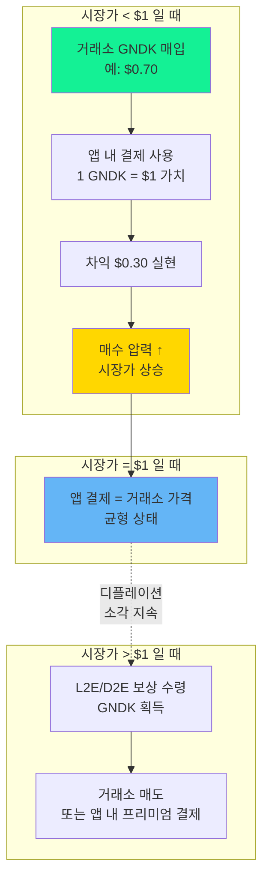

| 시나리오 | 메커니즘 |
|---------|---------|
| 시장가 < $1 | 구독자가 거래소에서 GNDK를 싸게 매입 → 앱 내 결제 ($1 가치)에 사용 → **자발적 매수 압력** |
| 시장가 = $1 | 앱 결제와 거래소 가격 균형 → 안정적 생태계 |
| 시장가 > $1 | 초과 시장가가 앱 내 결제에도 인정 → 사용자 경제적 혜택 극대화 |

> **10만+ 유료 구독자의 지속적 결제 수요**가 거래소 유통량을 꾸준히 흡수하여, 가격이 $1 수준으로 수렴하는 자기 유지형 매수 압력을 형성합니다.

### 7.4 거버넌스 & 보안 정책 (Trust & Security)

| 정책 | 내용 |
|------|------|
| **Mint Authority 영구 포기** | TGE 직후 10억 토큰 발행 완료 → Mint Authority를 스마트 컨트랙트상에서 영구 소각(burned). 재단 임의 발행 리스크 = **정확히 0%** |
| **긴급 정지(Pause) 기능** | 프로그램 레벨 Pause — 해킹/익스플로잇 시 보상 분배·Claim·소각 처리를 중단. 토큰 자체의 전송·거래는 영향 없음 (Freeze Authority Renounce로 탈중앙화 유지) |
| **단계적 탈중앙화** | 초기: eKYSS 중앙 서버 (Direct Transfer) → 50,000 DAU 달성 후: Multi-sig + DAO 거버넌스 구조로 이관 |

> **Solana 구현**: Mint Authority를 `set_authority` instruction으로 `None`으로 설정하여 영구 포기. Freeze Authority도 동일하게 비활성화. 이후 어떤 주체도 추가 발행 불가.

---

## 8. Solana 프로그램 구조

### 8.1 모듈러 아키텍처 (Registry + Module 패턴)

> **설계 원칙**: 코어(RewardRegistry)가 생태계 보상 풀을 관리하고, 각 보상 유형은 **독립 모듈 프로그램**으로 배포됩니다. 새 모듈 추가 시 코어 수정 없이 Registry에 등록만 하면 보상 풀 접근이 가능합니다.

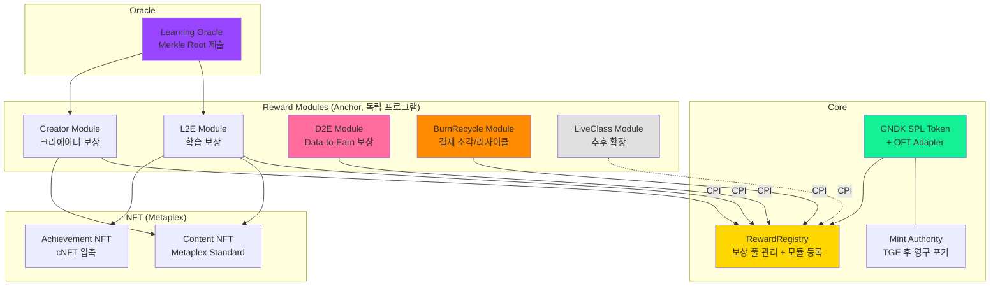

### 8.2 RewardRegistry (코어 프로그램)

> **모든 보상 모듈의 게이트웨이**. 생태계 보상 풀 Token Account를 직접 관리하며, 등록된 모듈만 CPI를 통해 보상 풀에서 토큰을 전송할 수 있습니다.

```
RewardRegistry Program (Anchor):

├── initialize(admin: Pubkey, ecosystem_pool: TokenAccount)
│   └── TGE 시 1회 실행
│   └── ConfigAccount PDA 생성
│
├── register_module(module_program_id: Pubkey, name: String, daily_limit: u64)
│   └── Multi-sig 승인 필요
│   └── 새 보상 모듈을 Registry에 등록
│   └── ModuleAccount PDA 생성 (모듈별 한도, 활성 상태)
│
├── deactivate_module(module_program_id: Pubkey)
│   └── Multi-sig 승인 필요
│   └── 모듈 비활성화 (보상 풀 접근 차단)
│
├── transfer_from_pool(module: Pubkey, user: Pubkey, amount: u64)
│   └── CPI로만 호출 가능 (등록된 활성 모듈만)
│   └── 생태계 보상 풀 → 사용자 Token Account 전송
│   └── 모듈별 일일 한도 검증
│   └── 인당 연간 한도 검증 (Dynamic Halving Phase 기반)
│   └── Stage 1 보안: 모듈별 일일 인출 한도 적용 (키 탈취 시 피해 범위 제한)
│
├── register_user(user: Pubkey)
│   └── 오라클이 KYC 인증된 사용자만 호출
│   └── UserAccount PDA 생성 (연간 수령량 추적)
│   └── total_registered_users += 1 → Phase 자동 전환 체크
│
├── pause() / unpause()
│   └── Multi-sig 승인 필요
│   └── 모든 모듈의 보상 분배 일시 중단/재개
│
├── transfer_from_d2e_pool(module: Pubkey, user: Pubkey, amount: u64)
│   └── CPI로만 호출 가능 (D2E Module 전용)
│   └── D2E Bounty Pool → 사용자 Token Account 전송
│   └── D2E 별도 한도 검증 (L2E 연간 한도와 독립)
│
└── 저장소 (Accounts)
    ├── ConfigAccount (PDA): admin, oracle, phase info, global_pause 상태
    ├── EcosystemRewardPool (PDA): L2E 생태계 보상 풀 Token Account
    ├── D2EBountyPool (PDA): D2E 바운티 풀 Token Account (T-2)
    ├── ModuleAccount (PDA): 모듈별 program_id, 한도, 활성 상태, module_pause
    └── UserAccount (PDA): 사용자별 l2e_annual_claimed, d2e_annual_claimed, 등록 시점
```

### 8.3 BurnRecycle (결제 소각/리사이클 프로그램)

> 서비스 결제에 사용된 GNDK를 수집하여 **50% 영구 소각 + 50% 생태계 보상 풀 리사이클**을 자동 처리합니다.

```
BurnRecycle Program (Anchor):

├── process_payment(amount: u64)
│   └── 앱 서버 또는 결제 모듈이 호출
│   └── 결제 수집 Token Account에서:
│       └── 50% → SPL Token burn (영구 소각)
│       └── 50% → EcosystemRewardPool로 transfer (리사이클)
│   └── emit!(BurnRecycleEvent { burned, recycled, timestamp })
│
├── admin_burn(amount: u64)
│   └── Multi-sig 관리자만 호출 가능 (T-3)
│   └── 관리자가 시장 매입한 GNDK를 영구 소각
│   └── B2B Buyback & Burn, 영업이익 바이백 등에 사용
│   └── emit!(AdminBurnEvent { amount, timestamp, tx_hash_ref })
│
├── get_burn_stats() -> BurnStats
│   └── 누적 소각량 (payment_burn + admin_burn), 누적 리사이클량 조회
│
└── 저장소 (Accounts)
    ├── PaymentCollector (PDA): 결제 GNDK 수집 Token Account
    ├── BurnStats (PDA): 누적 소각/리사이클 통계 (payment_burned, admin_burned, recycled)
    └── ConfigAccount (PDA): admin, is_paused 상태
        ※ burn_ratio는 50% 상수 고정 (const BURN_RATIO: u64 = 50). 변경 시 프로그램 업그레이드 필요 — 투자자 신뢰 확보.
```

### 8.4 L2E Module — 보상 분배 프로그램

> **Stage 1 (Direct Transfer)**: TGE 직후에는 eKYSS 중앙 서버에서 생태계 보상 풀(3억 GNDK)의 Token Account로부터 사용자 지갑으로 직접 전송합니다. 사용자 가스비 부담 0%.
>
> **Stage 2 (Merkle 기반)**: 50,000 DAU 달성 후 Merkle 기반 배치 처리 + Multi-sig/DAO 구조로 전환.

```
L2E Module (Anchor):

[Stage 1: Direct Transfer — 초기 운영]
├── distribute_reward(user: Pubkey, amount: u64)
│   └── eKYSS 서버 권한으로 호출
│   └── 생태계 보상 풀 Token Account → 사용자 Token Account 직접 전송
│   └── 인당 연간 최대 70 GNDK 하드캡 검증 (Dynamic Halving)

[Stage 2: Merkle 기반 — 탈중앙화 전환 후]
├── submit_merkle_root(root: [u8; 32], epoch: u64)
│   └── 오라클 Pubkey만 호출 가능 (Multi-sig 승인)
│   └── 주기별 학습 보상 데이터의 Merkle Root 제출
│
├── claim(amount: u64, proof: Vec<[u8; 32]>)
│   └── 사용자가 Merkle Proof와 함께 보상 요청
│   └── Proof 검증 후 생태계 보상 풀에서 전송 (Mint 아님)
│
├── is_claimed(user: Pubkey, epoch: u64) -> bool
│   └── PDA 기반 Claim 상태 관리, 중복 수령 방지
│
└── 저장소 (Accounts)
    ├── MerkleRootAccount (PDA): epoch별 root 저장
    ├── ClaimStatusAccount (PDA): user+epoch별 claim 여부
    └── ConfigAccount (PDA): oracle pubkey, admin authority, is_paused 등
    ※ EcosystemRewardPool은 RewardRegistry가 관리 — L2E는 CPI로만 접근 (T-1)
```

### 8.5 프로그램 목록

| 프로그램 | 역할 | 배포 시기 | 비고 |
|---------|------|----------|------|
| GNDK Token (SPL) | 메인 토큰 | TGE | **SPL Token** (기본 표준) |
| OFT Adapter | 멀티체인 브릿지 | TGE+6개월 | LayerZero 연동 (Solana OFT 생태계 성숙도 고려, TGE에서 분리) |
| **RewardRegistry** | **보상 풀 관리 + 모듈 등록** | **TGE** | **Anchor — 코어 프로그램** |
| **BurnRecycle** | **결제 소각 50% + 리사이클 50%** | **TGE** | **Anchor Program** |
| L2E Module | 학습 보상 (Direct Transfer → Merkle) | TGE | Anchor — Registry 모듈 |
| Creator Module | 크리에이터 보상, 로열티 분배 | 확장 시 | Anchor — Registry 모듈 |
| D2E Module | D2E 데이터 바운티 미션 관리 및 보상 분배 | 확장 시 | Anchor — Registry 모듈 |
| ContentNFT | 콘텐츠 NFT | TGE | Metaplex Standard |
| AchievementNFT | 학습 성취 배지 | TGE | **cNFT (압축 NFT)** |
| VestingProgram | 베스팅/락업 관리 | TGE | **커스텀 Anchor** (T-9) |
| LiveClass Module | 라이브 수업 보상 | 확장 시 | Anchor — Registry 모듈 |
| Governance | 거버넌스 투표 | 2027 Q3 | Realms (SPL Governance) |
| Staking | 스테이킹 보상 | 2027 Q3 | Anchor Program |

> **cNFT (Compressed NFT)**: 학습 성취 배지는 대량 발행이 예상되므로, Solana의 State Compression + Metaplex Bubblegum을 사용한 압축 NFT로 발행. 일반 NFT 대비 **비용 1/1000 수준**.

### 8.6 모듈 확장 프로세스

신규 보상 모듈 추가 시 **코어(RewardRegistry) 수정 없이**:

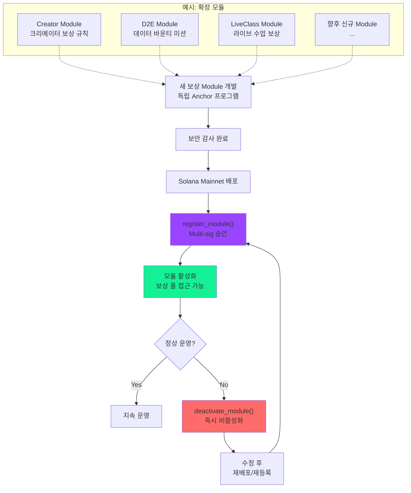

> **참고**: Mint Authority는 TGE 후 영구 포기되므로, 모든 보상 모듈은 기존 생태계 보상 풀(3억 GNDK)에서 전송하는 방식으로만 동작합니다. 각 모듈은 Registry에 등록된 CPI 권한으로만 풀에 접근할 수 있어, 미등록 프로그램의 무단 인출이 불가능합니다.

### 8.7 Solana 특수 고려사항

| 항목 | 설명 |
|------|------|
| **Account Rent** | Solana는 Account 유지에 SOL 보증금(rent) 필요. 사용자 Token Account(ATA) + UserAccount PDA + ClaimStatusAccount PDA 등 복수 계정 생성 필요. **프로젝트 대납 확정** (B-10). ATA만 10만 유저 기준 약 200 SOL이나, PDA 포함 시 2~3배 예상 — **Phase 0에서 전체 PDA별 rent 시뮬레이션 필수**. |
| **Transaction Size** | 단일 트랜잭션 1232 bytes 제한. Merkle Proof 깊이에 따라 여러 트랜잭션 분할 필요 가능. |
| **Compute Units** | 트랜잭션당 200,000 CU 기본. Merkle 검증 시 CU 최적화 필요. |
| **Program Upgrade** | Anchor 프로그램은 upgrade authority로 업그레이드 가능. 안정화 후 immutable로 전환 고려. |

### 8.8 TGE 초기화 시퀀스

> **순서가 매우 중요합니다.** Mint Authority를 너무 일찍 포기하면 토큰 분배가 불가능해지고, 되돌릴 수 없습니다.

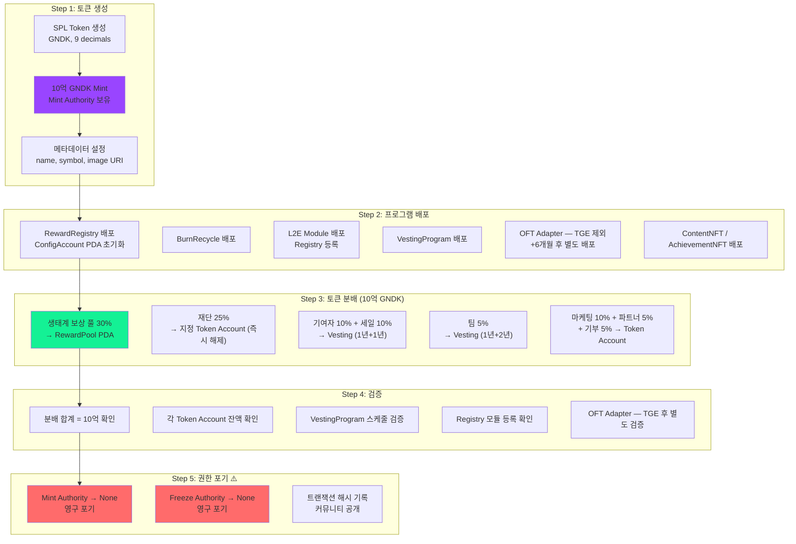

> **Devnet에서 최소 3회 리허설 필수.** Step 5 이후에는 어떤 주체도 GNDK를 추가 발행할 수 없습니다.

---

## 9. 멀티체인 확장 전략 (OFT)

### 9.1 왜 OFT인가?

> **GNDK는 TGE 시점부터 LayerZero OFT Adapter를 탑재하여, 향후 멀티체인 확장을 네이티브하게 지원합니다.**

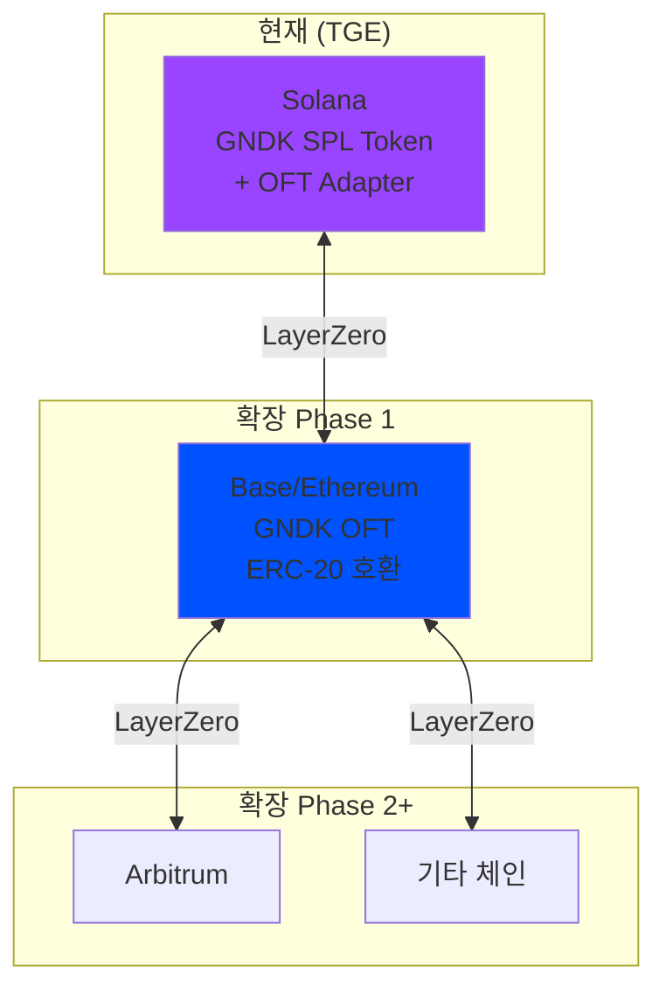

| 방식 | Lock & Mint (Wormhole) | Burn & Mint (OFT) ← 채택 |
|------|----------------------|--------------------------|
| 목적 체인 토큰명 | wGNDK (래핑) | **GNDK (네이티브)** |
| 사용자 경험 | "래핑 토큰" 인지 필요 | **어디서나 동일한 GNDK** |
| 총 공급량 관리 | Lock/Unlock으로 유지 | **Burn/Mint로 자동 유지** |
| 브릿지 의존성 | 외부 브릿지 (해킹 리스크) | **LayerZero 프로토콜 내장** |
| 확장성 | 체인별 별도 연동 | **OFT 배포만으로 확장** |

### 9.2 OFT 작동 원리

#### Solana → Base 전송 (Lock & Mint)

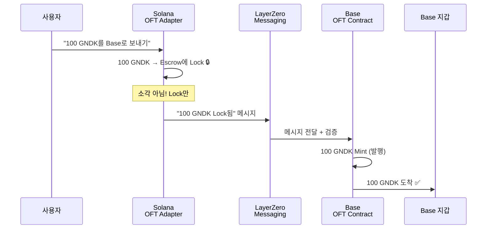

#### Base → Solana 복귀 (Burn & Unlock)

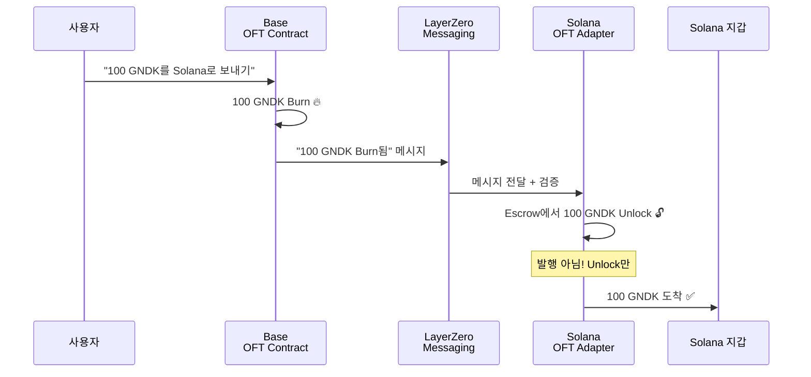

> **총 공급량**: 항상 10억 GNDK 유지 (체인 합산). 홈 체인(Solana)은 **Lock/Unlock**만 사용 → Mint Authority 영구 포기와 충돌 없음.

### 9.3 멀티체인 확장 타임라인

| 시기 | 체인 | 목적 | DEX |
|------|------|------|-----|
| TGE | Solana (메인, OFT 미포함) | L2E 보상, 주요 유동성 | Raydium, Jupiter |
| TGE+6~12개월 | Base 또는 Ethereum | DeFi 생태계 접근, 기관 투자 | Uniswap, Aerodrome |
| 이후 | 수요 기반 결정 | 글로벌 확장 | 체인별 주요 DEX |

### 9.4 멀티체인 유동성 부트스트래핑

새 체인 진출 시 초기 유동성 공급 절차:

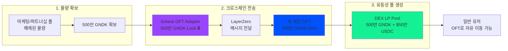

> **주의**: 락업(베스팅) 중인 토큰은 이동 불가. 초기 유동성은 **이미 해제된 마케팅/파트너십/생태계 풀**에서만 사용.

### 9.5 멀티체인 리스크 및 대응

| 리스크 | 영향도 | 대응 방안 |
|--------|--------|----------|
| LayerZero 프로토콜 장애 | 중간 | 체인별 독립 운영 가능, 장애 시 전송만 일시 중단 |
| 유동성 분산 | 중간 | 메인 체인(Solana)에 주요 유동성 집중, 새 체인은 보조 |
| 체인 간 가격 괴리 | 낮음 | 아비트라지 봇이 자동 조정, OFT 전송 비용 극히 저렴 |
| 총 공급량 불일치 | 낮음 | Burn & Mint 방식으로 수학적 보장 |

---

## 10. 오라클 시스템

### 10.1 역할

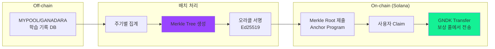

### 10.2 Merkle Tree 구조

```
Merkle Root (예: Phase 1 주간 배치, 인당 연간 최대 70 GNDK)
├── Hash(User1 Pubkey: 5 GNDK)     ← 주간 학습 보상
├── Hash(User2 Pubkey: 3 GNDK)     ← 주간 학습 보상
├── Hash(User3 Pubkey: 7 GNDK)     ← 주간 학습 보상
└── ...

각 사용자는 자신의 Merkle Proof로 보상 검증 및 Claim
Solana Pubkey 기반으로 Leaf 생성
누적 수령량이 연간 한도 초과 시 컨트랙트에서 거부
```

### 10.3 단계별 운영

```mermaid
graph LR
    subgraph "Phase 1 — TGE"
        A[중앙화 오라클<br/>eKYSS 직접 운영<br/>Ed25519 키페어]
    end

    subgraph "Phase 2 — +6개월"
        B[Multi-sig 오라클<br/>Squads 다중 서명<br/>3/5 승인 필요]
    end

    subgraph "Phase 3 — +18개월"
        C[탈중앙화 오라클<br/>커뮤니티 검증자<br/>DAO 거버넌스]
    end

    A -->|"안정화 후"| B -->|"DAO 전환 후"| C

    style A fill:#FFD700
    style B fill:#9945FF
    style C fill:#14F195
```

| 단계 | 방식 | 시기 | 특징 |
|------|------|------|------|
| Phase 1 | 중앙화 오라클 | TGE | 이카이스 직접 운영 (Ed25519 키페어) |
| Phase 2 | 다중 서명 | +6개월 | Squads Multi-sig (Solana 표준) |
| Phase 3 | 탈중앙화 | +18개월 | 커뮤니티 검증자 (선택) |

---

## 11. 프로그램 발행 전 체크리스트

### 11.1 필수 확정 사항

프로그램 개발 착수 전 반드시 확정해야 할 항목들입니다.

**토큰 기본 설정**

- [x] ~~초기 발행량 최종 확정~~ → **10억 GNDK 확정**
- [x] ~~소수점 자릿수 확정~~ → **9 (Solana 표준) 확정**
- [x] ~~SPL Token vs Token-2022 선택~~ → **SPL Token (기본 표준) 확정**
- [ ] 토큰 메타데이터 (name, symbol, image URI) 최종 확인
- [x] ~~Mint Authority 영구 포기 절차 확인~~ → **TGE Step 5에서 set_authority → None (Section 8.8)**
- [x] ~~Freeze Authority 비활성화 확인~~ → **TGE Step 5에서 동시 Renounce (Section 8.8)**

**OFT Adapter 설정**

- [ ] LayerZero Endpoint 연동 확인
- [ ] OFT Adapter 배포 시점 (TGE 동시 vs 이후)
- [ ] 초기 지원 체인 목록 확정
- [ ] 크로스체인 전송 수수료 정책

**Epoch 및 배치 처리**

- [x] ~~Epoch 주기 확정~~ → **주간 (7일) 확정** (T-5). Stage 1에서는 무관 (Direct Transfer), Stage 2 전환 시 적용.
- [ ] Epoch당 최대 발행량 한도 설정 여부
- [ ] Merkle Root 제출 시간대 (UTC 기준)

**보상 정책**

- [x] ~~일일 최대 획득 GNDK 한도~~ → **온체인 일일 한도 없음** (T-6). 연간 한도만 적용. 일일 속도 제어는 off-chain.
- [x] ~~동적 보상 조절 계산 위치~~ → **Off-chain (앱 서버에서 포인트→GNDK 계산, SC는 연간 한도만 검증) 확정 (Section 4.4)**
- [x] ~~동적 보상 조절 기준 사용자 수 임계값 최종 확정~~ → **100K / 1M / 10M / 100M 확정 (Section 4.6)**

**크리에이터 경제**

- [ ] 콘텐츠 등록 초기 보상 확정 (현재: 100 GNDK)
- [ ] 학습 Fee 비율 확정 (현재: 10%)
- [ ] 2차 저작물 로열티 비율 확정 (현재: 원작 5%, 2차 5%, 플랫폼 2%)

**권한 및 보안**

- [x] ~~오라클 Pubkey~~ → **TGE: 단일 Ed25519 → 6개월 후: Squads 3/5 Multi-sig** (T-7)
- [x] ~~관리자 권한 구조~~ → **0~12mo: 단일 Authority → 6mo: Multi-sig → 18mo+: immutable 검토** (T-8)
- [x] ~~긴급 정지(Pause) 기능 포함 여부~~ → **프로그램 레벨 Pause 포함 확정 (Section 7.4, 8.2)**
- [x] ~~프로그램 업그레이드 정책~~ → **18개월 후 보안 감사 2회 완료 확인 후 immutable 전환** (T-8)

**초기 분배**

- [ ] 각 분배 항목별 수령 지갑 Pubkey
- [ ] TGE 시 즉시 해제되는 물량 확정
- [x] ~~베스팅 프로그램 선택~~ → **커스텀 Anchor 프로그램** (T-9)
- [x] ~~Token Account Rent 대납 정책~~ → **프로젝트 대납 확정** (B-10). 10만 유저 기준 ~200 SOL.

**Burn & Recycle**

- [x] ~~서비스 결제 시 50/50 (소각/리사이클) 비율 최종 확정~~ → **50% 소각 + 50% 리사이클 확정 (Section 6.2, 8.3)**
- [x] ~~미교환 포인트 소각 정책~~ → **완전 off-chain 처리** (T-12). 포인트 소멸 시 전환 요청 미발생 → 보상 풀 잔류.
- [x] ~~바이백 & 소각 트리거 조건~~ → **SC 무관, off-chain 경영 재량** (B-9). SC는 `admin_burn()` instruction만 제공.

**D2E (Data-to-Earn)**

- [x] ~~D2E Bounty Pool 초기 시드 물량~~ → **초기 시드 없음, B2B 매출 발생 시 자연 축적** (B-4)
- [x] ~~B2B 매출 분배 비율~~ → **40% Burn + 30% D2E Pool + 30% 운영비 확정** (B-5, 백서 v2.5)
- [ ] D2E 바운티 미션 관리 구조 (온체인 미션 등록 vs 오프체인 관리) — D2E Module 확장 시 결정
- [x] ~~D2E 보상이 L2E 연간 한도에 포함되지 않음 구분~~ → **모듈 분리 + 별도 풀 + 별도 필드로 자동 구분** (T-10)
- [ ] 데이터 Opt-in 동의 기록 방식 (온체인 vs 오프체인) — D2E Module 확장 시 결정

### 11.2 개발 환경 결정 사항

- [x] ~~Anchor 버전~~ → **개발 시작 시점 최신 안정 버전, Anchor.toml에 고정** (T-11)
- [ ] Solana CLI 버전
- [ ] 테스트: Solana Devnet (+ localnet 로컬 테스트)
- [ ] 프론트엔드 연동: @solana/web3.js + @solana/spl-token (+ Wallet Adapter)
- [ ] 지갑 지원: Phantom, Solflare, Backpack
- [ ] 오라클 서버 기술 스택

### 11.3 배포 전 필수 완료

- [ ] 단위 테스트 100% 커버리지 (Anchor test)
- [ ] 통합 테스트 완료
- [ ] Devnet 배포 및 검증 (최소 2주)
- [ ] 보안 감사 완료 (감사 업체: **Certik 확정**)
- [ ] 버그 바운티 프로그램 준비
- [ ] 비상 대응 절차 문서화

---

## 12. Solana 프로그램 개발 프로세스

### 12.1 개발 환경

```mermaid
graph LR
    subgraph "개발"
        A[Rust/Anchor 작성]
        B[localnet 테스트]
    end

    subgraph "테스트넷"
        C[Solana Devnet 배포]
        D[통합 테스트]
        E[오라클 연동 테스트]
    end

    subgraph "감사"
        F[내부 리뷰]
        G[외부 보안 감사]
        H[버그 바운티]
    end

    subgraph "메인넷"
        I[Solana Mainnet 배포]
        J[모니터링]
    end

    A --> B --> C --> D --> E
    E --> F --> G --> H
    H --> I --> J

    style G fill:#FF6B6B
    style I fill:#14F195
```

### 12.2 개발 단계별 상세

**Phase 1: 로컬 개발**

| 단계 | 도구 | 산출물 |
|------|------|--------|
| 프로그램 작성 | Rust + Anchor Framework | .rs 파일들 (lib.rs, instructions/, state/) |
| 단위 테스트 | `anchor test` (Mocha/TS) | 테스트 코드 |
| 로컬 배포 | `solana-test-validator` | 로컬 검증 |
| CU 최적화 | Compute Unit 프로파일링 | 최적화된 코드 |

**Phase 2: 테스트넷**

| 단계 | 내용 | 체크포인트 |
|------|------|-----------|
| 배포 | Solana Devnet | Program ID 확보 |
| 기능 테스트 | 모든 instruction 호출 | 정상 동작 확인 |
| 오라클 연동 | Merkle Root 제출 | 배치 처리 검증 |
| Claim 테스트 | 사용자 보상 수령 | Merkle Proof 검증 |
| OFT 테스트 | LayerZero testnet 크로스체인 | Burn & Mint 검증 |
| 스트레스 테스트 | 대량 트랜잭션 | CU/성능 확인 |
| 프론트 연동 | Wallet Adapter + 웹 UI | E2E 테스트 |

**Phase 3: 보안 감사**

| 단계 | 수행자 | 목적 |
|------|--------|------|
| 내부 코드 리뷰 | 개발팀 | 로직 오류 발견 |
| 자동화 분석 | Soteria, cargo-audit | 알려진 취약점 탐지 |
| 외부 감사 | 전문 업체 | 종합 보안 검증 |
| 감사 보고서 대응 | 개발팀 | 발견 이슈 수정 |
| 재감사 | 감사 업체 | 수정 확인 |

**Phase 4: 메인넷 배포**

| 단계 | 내용 |
|------|------|
| 배포 계획 | 순서, 시간, 담당자 확정 |
| 배포 실행 | Solana Mainnet-Beta 배포 |
| 검증 | Solscan/Solana Explorer 소스 코드 공개 |
| 초기화 | Mint Authority 설정, 초기 분배, OFT Adapter 연결 |
| 모니터링 | 24/7 이상 탐지 (Helius/Shyft 알림) |

### 12.3 테스트 종류

| 테스트 유형 | 목적 | 도구 |
|------------|------|------|
| 단위 테스트 | 개별 instruction 검증 | Anchor test (Mocha/TS) |
| 통합 테스트 | 프로그램 간 연동 | Anchor test + Bankrun |
| Fuzz 테스트 | 랜덤 입력으로 엣지케이스 발견 | Trident (Solana Fuzz) |
| Property 테스트 | 불변 조건 검증 | Trident |
| Devnet 테스트 | 실제 네트워크 환경 | Solana Devnet |
| E2E 테스트 | 프론트엔드 포함 전체 흐름 | Cypress/Playwright + Wallet Adapter |

### 12.4 보안 감사 업체

> **선정 완료: Certik**

| 업체 | 특징 | 예상 비용 | 비고 |
|------|------|----------|------|
| **Certik** ✅ | 빠른 진행, 높은 인지도, Solana 감사 경험 보유 | $20K-50K | **확정** |
| OtterSec | Solana 생태계 최고, Wormhole 감사 | $50K+ | 참고 |
| Neodyme | Solana 전문, 깊은 Rust 분석 | $40K+ | 참고 |
| Sec3 (구 Soteria) | 자동화 + 수동 감사 병행 | $30K-60K | 참고 |
| Halborn | Solana 경험 풍부 | $30K-50K | 참고 |

> **감사 일정**: 개발 Phase 3 진입 시 Certik에 사전 예약. 감사 기간 약 6~10주 소요. 감사 대상은 RewardRegistry, BurnRecycle, L2E Module, VestingProgram 4개 프로그램.

### 12.5 개발 프레임워크

| 항목 | Anchor (추천) | Native Solana |
|------|-------------|--------------|
| 언어 | Rust (매크로 지원) | Rust (순수) |
| 보일러플레이트 | 자동 생성 | 직접 작성 |
| Account 직렬화 | 자동 (Borsh) | 직접 구현 |
| 테스트 | TypeScript/Mocha 내장 | 직접 구성 |
| IDL 생성 | 자동 (클라이언트 SDK) | 직접 작성 |
| 커뮤니티 | 매우 활발 | 제한적 |
| 추천 | **대부분의 경우 추천** | 극한 최적화 필요 시 |

---

## 13. 향후 기술 검토 사항

- ~~Solana 프로그램 보안 감사 업체 선정~~ → **Certik 확정** (B-8, Section 12.4)
- OFT Adapter 확장 체인 우선순위 (Base > Ethereum > Arbitrum)
- 오라클 탈중앙화 로드맵 구체화
- Merkle Tree 생성 주기 최적화 (일간 가능)
- cNFT State Compression 비용 최적화
- D2E Bounty Pool 자금 유입 자동화 (Jupiter Aggregator 연동 Buyback 메커니즘)
- D2E 미션 검증 온체인/오프체인 역할 분담 설계
- 듀얼 토큰 도입 검토 (거버넌스/유틸리티 분리)
- DAO 전환 로드맵 (Realms 기반)
- Solana Actions / Blinks 연동 (학습 보상 Claim UX)

---

## 부록 A: 용어 정의

| 용어 | 정의 |
|------|------|
| L2E | Learn-to-Earn, 학습을 통해 보상을 얻는 모델 |
| D2E | Data-to-Earn, 학습 과정에서 생성되는 데이터를 AI 기업에 공급하고 보상을 얻는 모델 |
| Voice-to-Earn | D2E의 음성 데이터 수집 메커니즘 — 다국어 발음/악센트 데이터 → AI STT/TTS 학습용 |
| Translate-to-Earn | D2E의 번역 데이터 수집 메커니즘 — AI 번역 교정 → RLHF 데이터셋 |
| Chat-to-Earn | D2E의 대화 데이터 수집 메커니즘 — AI 아바타와 롤플레잉 대화 → LLM 파인튜닝용 코퍼스 |
| RLHF | Reinforcement Learning from Human Feedback, 인간 피드백 기반 강화학습 |
| Data Bounty | D2E에서 특정 AI 데이터 미션 수행 시 지급되는 프리미엄 GNDK 보상 |
| Dual-Engine | 서비스 결제 소각 + B2B 데이터 매출 Buyback & Burn, 두 개의 독립적 디플레이션 엔진 |
| PoL | Proof of Learning, 학습 활동을 검증하는 증명 방식 |
| TGE | Token Generation Event, 토큰 최초 발행 이벤트 |
| 베스팅 | 토큰을 일정 기간에 걸쳐 분할 지급하는 방식 |
| 클리프 | 베스팅 시작 전 토큰이 잠겨있는 기간 |
| 오라클 | 블록체인 외부 데이터를 온체인 프로그램에 전달하는 시스템 |
| 소각 | 토큰을 영구적으로 유통에서 제거하는 행위 |
| Merkle Tree | 데이터 무결성 검증을 위한 해시 트리 구조 |
| Merkle Root | Merkle Tree의 최상위 해시값 |
| Merkle Proof | 특정 데이터가 Merkle Tree에 포함됨을 증명하는 해시 경로 |
| Claim | 사용자가 보상을 요청하여 수령하는 행위 |
| **SPL Token** | **Solana Program Library Token — Solana의 토큰 표준** |
| **PDA** | **Program Derived Address — 프로그램이 제어하는 계정 주소** |
| **Anchor** | **Solana 스마트 컨트랙트(Program) 개발 프레임워크** |
| **OFT** | **Omnichain Fungible Token — LayerZero 기반 멀티체인 토큰 표준** |
| **OFT Adapter** | **기존 SPL Token에 OFT 기능을 추가하는 래퍼 프로그램** |
| **cNFT** | **Compressed NFT — State Compression으로 대량 발행 비용 절감** |
| **Metaplex** | **Solana의 NFT 표준 및 인프라** |
| **CU** | **Compute Unit — Solana 트랜잭션 실행 비용 단위** |
| **Squads** | **Solana의 Multi-sig 솔루션 (Gnosis Safe의 Solana 버전)** |
| **Realms** | **SPL Governance 기반 DAO/거버넌스 플랫폼** |

---

## 부록 B: 참고 자료

- [gndtoken.com](https://gndtoken.com) - 공식 토큰 사이트
- [Solana Documentation](https://solana.com/docs) - Solana 공식 문서
- [Anchor Framework](https://www.anchor-lang.com/) - Anchor 개발 프레임워크
- [SPL Token Program](https://spl.solana.com/token) - SPL 토큰 표준
- ~~[Token-2022](https://spl.solana.com/token-2022) - 확장 토큰 표준~~ *(참고용 — 본 프로젝트는 SPL Token 기본 표준 채택)*
- [LayerZero OFT](https://docs.layerzero.network/v2/home/protocol/contract-standards#oft) - OFT 표준 문서
- [Metaplex](https://developers.metaplex.com/) - NFT 표준
- [Metaplex Bubblegum](https://developers.metaplex.com/bubblegum) - 압축 NFT (cNFT)
- [Jupiter Aggregator](https://station.jup.ag/) - DEX 애그리게이터
- [Raydium](https://raydium.io/) - AMM DEX
- [Squads Protocol](https://squads.so/) - Multi-sig
- [Realms](https://realms.today/) - 거버넌스
- [Merkle Tree](https://en.wikipedia.org/wiki/Merkle_tree) - Merkle Tree 개념

---

**문서 끝**

*이 문서는 GNDK 스마트 컨트랙트 제작을 위한 기술 설계서입니다.*
*백서(WhitePaper) v2.5 기준으로 작성되었으며, 비즈니스/법률/팀 정보는 백서를 참조하십시오.*

---

**변경 이력**

| 버전 | 날짜 | 변경 내용 |
|------|------|----------|
| 1.0 | 2025-01-24 | 초안 작성 (원본) |
| 1.1 | 2025-01-24 | gndtoken.com 정보 반영, 팀/로드맵 추가 |
| 1.2 | 2025-01-24 | 토큰 심볼 GNDK로 변경, Merkle 기반 배치 L2E 구조 적용 |
| 1.3 | 2026-02-10 | gndtoken.com 홈페이지 동기화 (토큰 분배, 어드바이저, 로드맵 등) |
| **2.0-sol** | **2026-02-10** | **Solana 체인 버전 fork**: SPL Token + OFT Adapter 기반 전환, Rust/Anchor 개발 스택, Solana 생태계 도구 (Metaplex, Raydium, Jupiter, Squads, Realms), 멀티체인 확장 전략 (LayerZero OFT Burn&Mint) 신규 추가, cNFT 압축 NFT 도입, Solana 전문 보안 감사 업체 목록 |
| **2.3-sol** | **2026-03-09** | **백서 v2.3 동기화**: 고정 공급 모델 전환 (감소형 인플레이션 → 10억 고정 + Mint Authority 영구 포기), $1 Peg 메커니즘 추가, Burn & Recycle 50/50 모델 도입, Dynamic Halving (70→40→15→3 GNDK) 적용, 재단 30%→25% + 기부/사회공헌 5% 신설, 베스팅 1년 락업 통일, 체크리스트 인플레이션→Burn&Recycle 항목 교체 |
| **2.5-sol** | **2026-03-09** | **백서 v2.5 동기화 + SC 설계서 전환**: D2E(Data-to-Earn) 개념 추가 (Voice/Translate/Chat-to-Earn), Dual-Engine 디플레이션 모델 (서비스 소각 + B2B Buyback&Burn), B2B 매출 분배 (40% Burn + 30% D2E Pool), Dual Reward 구조 (Basic L2E + Premium D2E), D2E Bounty Program 아키텍처 추가, SC 제작 불필요 섹션 삭제 (로드맵, 팀, 리스크, 부록C), 향후 검토 기술 항목만 유지, 용어집 D2E 관련 추가, 체크리스트 D2E 항목 추가 |
| **2.5.1-sol** | **2026-03-09** | **SC 설계 심화**: 포인트→GNDK 전환 시스템 (Section 4.4), RewardRegistry + Module CPI 모듈러 아키텍처 (Section 8.2), BurnRecycle 프로그램 스펙 (Section 8.3), TGE 초기화 시퀀스 (Section 8.8), Dynamic Halving 온체인 자동 Phase 전환 (Section 4.6), OFT Lock/Unlock 수정 (Section 9.4), SPL Token 확정 (Token-2022 제거), Merkle Tree 예시값 한도 내 수정 |
| **2.5.3-sol** | **2026-03-10** | **본문-부록C 동기화**: 부록 C 결정사항 본문 반영 — 베스팅 커스텀 Anchor 확정(T-9→Section 3.3, 8.5), 온체인 일일한도 삭제(T-6→Section 4.5), 미교환 포인트 off-chain 처리(T-12→Section 7.2), RewardRegistry에 D2EBountyPool 추가(T-2→Section 8.2), L2E 풀 직접접근→CPI 명시(T-1→Section 8.4), Rent 대납 확정(B-10→Section 8.7), 감사업체 Certik 확정(B-8→Section 13), BurnRecycle에 admin_burn() 추가(T-3→Section 8.3), 체크리스트 15개 항목 추가 체크(Section 11.1) |
| **2.5.2-sol** | **2026-03-09** | **문서 검수 + 설계 결정 확정**: CPI 방향 수정 (Module→Registry), OFT 표기 명확화 (Lock/Unlock 구분), 운영 단계 Phase→Stage 용어 분리, 프로그램 이름 통일 (L2E Module), 체크리스트 확정 항목 반영 (7개), Token-2022 참고자료 주석 처리. **부록 C 추가**: 기술 설계 12건 + 비즈니스 10건 = 총 22개 결정 사항 정리. 18건 추천안 확정, 경영진 확인 필요 4건(크리에이터 한도 금액, 토큰 로고, 감사 예산, 바이백 비율) 분리 |
| **2.5.4-sol** | **2026-03-11** | **설계 보완**: 연간 한도 UTC 캘린더 리셋 확정, Stage 1 일일 인출 한도 추가 (키 탈취 대응), BurnRecycle 50:50 상수 고정 확정, OFT Adapter TGE에서 분리 (+6개월 후 배포), Account Rent 전체 PDA 시뮬레이션 필요 명시, D2E 실행 전략 (계획/홍보 선행) 추가 |

---

## 부록 C: 설계 결정 사항 — 추천안 + 경영진 확인 필요 항목

> **이 섹션은 SC 개발 착수 전 필요한 모든 결정 사항을 정리한 것입니다.**
> 각 항목에 대해 백서 맥락과 Solana 생태계 베스트 프랙티스를 기준으로 **최적 추천안**을 제시합니다.
> 대부분의 항목은 추천안 그대로 채택 가능하며, **경영진 확인이 반드시 필요한 항목만 🔴로 표기**합니다.

### C.1 기술 설계 결정 (추천안 확정 — 개발 착수 시 적용)

> 아래 항목들은 Solana SC 개발의 표준적 베스트 프랙티스에 기반한 추천안입니다.
> 특별한 사유가 없으면 그대로 적용합니다.

| # | 항목 | 추천 결정 | 근거 |
|---|------|----------|------|
| T-1 | **L2E ↔ RewardRegistry 관계** | **L2E Module → RewardRegistry CPI 호출 구조**. L2E의 `distribute_reward()`는 내부에서 RewardRegistry의 `transfer_from_pool()`을 CPI로 호출. 보상 풀 Token Account는 RewardRegistry PDA만 소유. 어떤 모듈도 풀에 직접 접근 불가. | 보안 원칙: 단일 게이트웨이(Registry)만 풀 접근 → 미등록 프로그램의 무단 인출 원천 차단. Solana CPI 패턴의 표준 설계. |
| T-2 | **D2E Bounty Pool 관리** | **RewardRegistry가 통합 관리**. RewardRegistry 내에 `EcosystemRewardPool`(L2E용)과 `D2EBountyPool`(D2E용) 두 개의 PDA Token Account를 관리. D2E Module은 `transfer_from_d2e_pool()` CPI로 접근. | 풀 관리를 한 곳에 집중 → 감사 범위 축소, 잔액 추적 투명성 확보. 별도 프로그램으로 분리하면 복잡도만 증가. |
| T-3 | **B2B Buyback 온체인 구현** | **관리자 수동 매입 + BurnRecycle Program의 `admin_burn()` instruction으로 소각**. Jupiter에서 GNDK를 수동 매입 → 소각 전용 instruction 호출 → 소각 이벤트 온체인 기록. 완전 자동화(DCA 프로그램)는 v2에서 검토. | 완전 자동화는 Jupiter DCA + Keeper 인프라가 필요하여 복잡도 급증. 초기엔 수동 매입 + 온체인 소각 기록만으로 투명성 확보 충분. 매입 트랜잭션 해시도 공개하여 검증 가능. |
| T-4 | **Pause 정책** | **2단계 Pause**. ① RewardRegistry 글로벌 pause → 모든 모듈의 `transfer_from_pool` CPI 거부 (전체 보상 중단). ② 각 모듈 개별 pause → 해당 모듈만 중단 (다른 모듈 정상 운영). L2E Module에도 `is_paused` 필드 추가. | 예: BurnRecycle에 취약점 발견 시 BurnRecycle만 pause하고 L2E 보상은 계속 지급. 반대로 전체 긴급 상황에서는 Registry 글로벌 pause로 일괄 중단. 세밀한 제어 가능. |
| T-5 | **Epoch 주기** | **주간 (7일)**. Solana 비용은 일간도 가능하지만, 오라클 운영/Merkle Tree 생성/검증 부담을 고려하면 주간이 최적. Stage 1(Direct Transfer) 기간에는 Epoch 무관 (실시간 전송). Stage 2 전환 시 적용. | 일간: 운영 오버헤드 높고, 주간 대비 사용자 UX 개선 미미. 월간: 보상 수령까지 대기 너무 김. 주간이 균형점. 대부분의 L2E/GameFi 프로젝트가 주간 또는 격주 채택. |
| T-6 | **일일 최대 GNDK 한도** | **온체인 일일 한도 없음 (연간 한도만 적용)**. 일일 속도 제어는 off-chain(앱 서버)에서 포인트 지급량으로 조절. SC는 연간 누적 한도(Phase별 70/40/15/3 GNDK) 초과 여부만 검증. | 온체인에 일일 한도를 추가하면 "어제 한도가 남았는데 소멸?" 같은 에지 케이스 처리가 복잡. 연간 한도 하나로 충분하고 off-chain 제어가 더 유연. |
| T-7 | **오라클 키 구조** | **TGE: 단일 Ed25519 키페어 → 6개월 후: Squads 3/5 Multi-sig 전환**. Section 10.3의 기존 로드맵과 일치. ConfigAccount PDA에 `oracle_authority` 필드를 Pubkey로 저장하여, Multi-sig 전환 시 해당 Pubkey만 Squads Vault로 업데이트. | 초기 운영 민첩성 (키 하나로 빠른 대응) → 안정화 후 분산 서명으로 보안 강화. Squads는 Solana 표준 Multi-sig이며, 3/5 구조가 가용성과 보안의 균형점. |
| T-8 | **Upgrade Authority 정책** | **0~12개월: 개발팀 단일 Authority (핫픽스 대응). 6개월 시점: Squads Multi-sig로 이관. 18개월 이후: 보안 감사 2회 완료 확인 후 immutable 전환 검토** (RewardRegistry, BurnRecycle 우선). | 메인넷 초기에는 버그 핫픽스가 필수. 바로 immutable로 가면 치명적 버그 발견 시 대응 불가. 12~18개월 안정 운영 + 감사 완료 후 immutable이 업계 표준. |
| T-9 | **베스팅 프로그램** | **커스텀 Anchor 프로그램 개발**. 기능: 수혜자별 PDA (cliff_end, vesting_end, total_amount, claimed_amount), `claim()` instruction으로 선형 베스팅 계산 후 전송. | Bonfida Token Vesting은 유지보수 불활발하고 Anchor 최신 버전과 호환 이슈 가능. 커스텀 구현이 3개 instruction(initialize_vesting, claim, get_vesting_info) 정도로 단순하며 프로젝트 요구사항(즉시 해제 / 1+1년 / 1+2년)에 정확히 맞출 수 있음. |
| T-10 | **D2E/L2E 한도 구분** | **모듈 분리로 자동 구분**. RewardRegistry의 `transfer_from_pool()`은 호출한 Module Program ID를 검증하여 어떤 모듈의 보상인지 자동 식별. L2E Module → EcosystemRewardPool에서 전송 (연간 한도 적용). D2E Module → D2EBountyPool에서 전송 (별도 한도 or 무제한). UserAccount PDA에 `l2e_annual_claimed`와 `d2e_annual_claimed` 별도 필드. | 별도 모듈 + 별도 풀 + 별도 필드 = 3중 분리. 혼동 여지 없이 깔끔. 온체인에서 자체 증명 가능. |
| T-11 | **Anchor 버전** | **개발 시작 시점의 최신 안정 버전 사용** (현재 기준 0.30.x). Anchor.toml에 버전 고정. 개발 중 마이너 업데이트만 허용, 메이저 업그레이드 금지. | Anchor는 하위 호환성이 좋은 편이나, 메이저 버전 변경 시 IDL 구조 변경 위험. 버전 고정이 안전. |
| T-12 | **미교환 포인트 소각** | **완전 off-chain 처리**. 포인트 소멸 정책(유효기간, 최소 전환 임계값)은 앱 서버에서 관리. 소멸된 포인트에 해당하는 GNDK는 "전환 요청이 발생하지 않는 것"이므로 보상 풀에 그대로 잔류 → 결과적으로 보상 풀 보존 효과. 온체인 소각 instruction 불필요. | SC는 포인트 개념을 모름 (Section 4.4). 포인트가 소멸되면 단순히 GNDK 전환 요청이 오지 않는 것뿐. 별도 온체인 소각 로직 불필요 → 구현 단순화. |

### C.2 비즈니스 항목 — 추천안 (경영진 확인용)

> 아래 항목들은 기술적 최적해를 기준으로 한 추천안입니다.
> 경영 판단이 필요한 항목만 🔴로 표기합니다.

| # | 항목 | 추천 결정 | 근거 | 경영진 확인 |
|---|------|----------|------|-----------|
| B-1 | **크리에이터 보상 금액** | **Creator Module은 별도 풀 + 별도 한도로 운영**. 등록 100 GNDK, 조회 50 GNDK 등 크리에이터 보상은 L2E Dynamic Halving 한도에 포함되지 않음. 생태계 보상 풀(3억 GNDK) 내에서 크리에이터 전용 할당분을 사전 설정 (예: 전체 풀의 10% = 3천만 GNDK). | 크리에이터는 콘텐츠를 생산하여 생태계에 가치를 더하는 역할. 학습자(L2E)와 동일 한도를 적용하면 크리에이터 유치 불가. 별도 풀로 분리하면 L2E 보상 풀을 침식하지 않음. | 추천안 수용 가능 |
| B-2 | **크리에이터 연간 한도** | **Creator Module 확장 배포 시 결정 (보류)**. Creator Module은 "확장 시" 배포이므로, 구체적 한도 금액은 모듈 개발 착수 시 확정. 기본 방향: 별도 풀 + 별도 한도 (L2E Dynamic Halving과 독립). | TGE 코어 프로그램에는 영향 없음. RewardRegistry에 Creator Module 등록 시 `daily_limit` 파라미터로 제어 가능한 구조 이미 확보. | ✅ 보류 (확장 시 결정) |
| B-3 | **D2E Module 배포 시점** | **"확장 시" 유지 (TGE 미포함)**. 단, TGE 시 RewardRegistry에 D2EBountyPool PDA Token Account는 미리 생성 (빈 상태). D2E Module 개발 완료 시 Registry에 등록만 하면 즉시 운영 가능. | D2E는 B2B 데이터 바이어가 확보되어야 실질적 의미. TGE 시점에 B2B 계약 없이 모듈만 배포하면 빈 풀 + 빈 미션 = 혼란. 인프라(Pool PDA)만 선행 구축이 합리적. | 추천안 수용 가능 |
| B-4 | **D2E Bounty Pool 초기 시드** | **초기 시드 없음. B2B 매출 발생 시 자연 축적**. 매출의 30%로 시장 매입한 GNDK가 D2EBountyPool로 자동 유입. 초기 시드가 없어도 B2B 계약 체결 → 매출 발생 → Pool 채워짐 → D2E 미션 개시 순서로 자연스러운 흐름. | 생태계 보상 풀(3억)은 L2E 전용으로 설계됨. 여기서 D2E 시드를 떼어내면 L2E 장기 지속성 시뮬레이션이 깨짐. D2E는 "B2B 매출이 곧 보상 재원"이라는 자생적 구조가 핵심 가치. | 추천안 수용 가능 |
| B-5 | **B2B 매출 분배 비율** | **40% Buyback&Burn + 30% D2E Pool + 30% 운영비 — 백서 v2.5 그대로 확정**. | 백서에 명시된 비율. 변경 시 백서 개정 필요. 비율 자체가 Dual-Engine 디플레이션 모델의 핵심 설계값. | 추천안 수용 가능 |
| B-6 | **토큰 메타데이터** | name: `GANADA TOKEN`, symbol: `GNDK`, **image: 확보 완료**. TGE 시 Arweave 또는 IPFS에 영구 업로드 후 URI를 Metaplex 메타데이터에 설정. 정방형 PNG 권장 (512×512 이상). | 로고 이미지 확보 완료. 배포 시 영구 저장소 업로드만 남음. | ✅ 확보 완료 |
| B-7 | **OFT 초기 지원 체인** | **TGE: Solana만 (OFT Adapter 배포). 리모트 체인 없음**. TGE+6~12개월: Base 우선 확장 (DeFi 접근 + 낮은 가스비). Ethereum은 수요 확인 후 결정. | TGE 시점에 리모트 체인까지 동시 런칭하면 유동성 분산 + LayerZero 연동 테스트 부담. Solana에 유동성 집중 후 안정화 → Base 확장이 리스크 최소화 전략. Section 9.3 기존 타임라인과 일치. | 추천안 수용 가능 |
| B-8 | **보안 감사 업체** | **Certik 확정**. Solana/Rust 감사 경험 보유. 예상 비용 $20K~$50K. 감사 기간 6~10주. 개발 완료 시점에 맞춰 사전 예약 필요. | 업체 선정 완료. 감사 일정은 개발 Phase 3(보안 감사) 진입 시 조율. | ✅ 확정 (Certik) |
| B-9 | **바이백 & 소각 트리거** | **SC 무관 — 완전 off-chain 경영 판단**. 회사가 영업이익/B2B매출 중 바이백 금액을 결정(off-chain) → 시장에서 GNDK 매입(off-chain) → `admin_burn()` instruction으로 소각(on-chain). SC에는 "몇 % 바이백"이 인코딩되지 않음. 소각 instruction만 제공. 매입/소각 트랜잭션 해시를 커뮤니티에 공개하여 투명성 확보. | 바이백 비율은 시장 상황, 재무 상태에 따라 유동적으로 결정해야 하므로 컨트랙트에 고정하면 오히려 경직. off-chain 결정 + on-chain 소각 기록이 최적. | ✅ SC 설계 완료 (비율은 경영 재량) |
| B-10 | **Token Account Rent 대납** | **프로젝트 대납 확정. 사용자 첫 GNDK 수령 시 Associated Token Account(ATA) 생성 비용 ~0.002 SOL을 프로젝트가 부담.** 예산: 10만 유저 기준 약 200 SOL (~$30K @$150/SOL). | 소비자 앱에서 사용자에게 "SOL을 먼저 구매하세요"라고 하면 이탈률 급증. 모든 성공적인 Solana 소비자 앱(Stepn, Drip 등)이 ATA 생성비 대납. UX 필수 투자. | 추천안 수용 가능 |

### C.3 결정 현황 요약

> **총 22개 결정 사항 — 전건 해소 완료. SC 개발 착수 가능.**

| 구분 | 건수 | 상태 |
|------|------|------|
| 기술 설계 (T-1~T-12) | 12건 | ✅ 전건 추천안 확정 |
| 비즈니스 (B-1~B-10) | 10건 | ✅ 8건 확정 + 1건 보류(크리에이터, 확장 시 결정) + 1건 SC 무관(바이백 비율) |
| 🔴 경영진 확인 필요 | **0건** | 모두 해소됨 |

**해소 내역:**
- B-2 크리에이터 한도 → Creator Module 확장 시 결정 (TGE 무관)
- B-6 토큰 로고 → 확보 완료
- B-8 감사 업체 → Certik 확정
- B-9 바이백 비율 → SC 무관 (off-chain 경영 재량, SC는 소각 instruction만 제공)

> **이 문서는 SC 개발을 위한 모든 설계 결정이 완료된 상태입니다.**
> 개발 착수 시 Section 8 (프로그램 구조) + 부록 C.1 (기술 설계 결정)을 기준으로 진행합니다.
